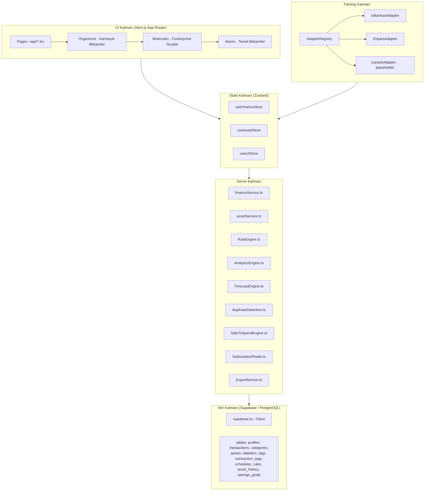
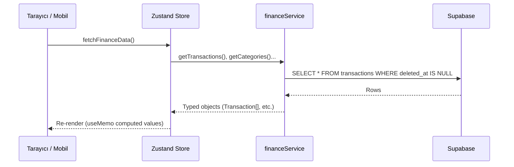

# 🏗️ FinanceV2 — Mimari Genel Bakış (Master Overview)

> Bu dosya, projenin tüm katmanlarını, ilişkilerini ve teknoloji yığınını kuş bakışı açıdan açıklar.
> Detaylı katman dökümantasyonu için alt dosyalara bakın.

---

## 1. Projenin Amacı

**FinanceV2**, bir ailenin tüm mali yaşamını tek bir platformda yönetmesini sağlayan bir **Kişisel Finans ve Varlık Yönetim Asistanı**'dır. Temel yetenekleri:

- Banka ekstreleri (PDF/Excel) otomatik içe aktarma ve kategorize etme
- Çoklu varlık (banka hesabı, altın, döviz, gayrimenkul) takibi
- Borç ve taksit yönetimi (amortizasyon hesaplama)
- Bütçe belirleme ve gerçek harcama karşılaştırması
- 6 aylık nakit akışı projeksiyonu (Oracle Engine)
- Kategori bazlı anomali tespiti ve akıllı uyarılar
- Aile içi borç dengeleme (rebalancing)

---

## 2. Teknoloji Yığını

| Katman | Teknoloji | Sürüm / Notlar |
|--------|-----------|---------------|
| **Frontend Framework** | Next.js (App Router) | Static Export modu (`output: 'export'`) |
| **Dil** | TypeScript | Strict tip sistemi |
| **Stil** | Tailwind CSS | Özel utility sınıfları, dark/light mode |
| **UI Bileşenleri** | shadcn/ui (Radix UI tabanlı) | Dialog, Select, datepicker vb. |
| **State Yönetimi** | Zustand + Persist Middleware | localStorage'a serialize edilir |
| **Backend / DB** | Supabase (PostgreSQL) | Row Level Security (RLS) aktif |
| **Auth** | Supabase Auth | Email/OTP (Faz 14'e kadar manuel bypass) |
| **Mobil** | Capacitor | Web → iOS/Android native köprüsü |
| **İkon Seti** | Lucide React | — |
| **Grafik** | Recharts | AreaChart, BarChart, LineChart |
| **Excel Parsing** | xlsx (SheetJS) | `.xlsx` ve `.xls` desteği |
| **PDF Parsing** | pdfjs-dist | Web Worker ile async işleme |
| **PWA** | Service Worker | Çevrimdışı veri giriş desteği |
| **Deployment** | Vercel | CI/CD otomatik |

---

## 3. Sistem Katmanları



---

## 4. Uygulama Sayfaları (Route Haritası)

```
/ (Dashboard)
    ├── Safe-to-Spend Widget
    ├── StatsSummary (Gelir / Gider / Net Worth)
    ├── OracleChart (6 Aylık Tahmin Grafiği)
    ├── HeatmapCard (Harcama Yoğunluk Haritası)
    ├── RunningBalanceChart
    ├── UpcomingPayments
    ├── SpendingVelocityCard
    ├── BudgetSummary → [/categories/detail?id=...]
    └── TagSpendingChart

/transactions (Master Ledger)
    ├── TransactionList (filtrelenebilir, sıralanabilir)
    ├── "Manuel İşlem Ekle" butonu → TransactionForm Dialog (borç bağlama destekli)
    ├── BulkActionBar (seçim → toplu kategori/etiket/silme)
    └── FileUploader → ImportPreviewModal (her satırda "Borç Bağla" seçicisi)

/vault (Varlık & Envanter)
    ├── AssetDetail (fatura, garanti takibi)
    ├── LiabilityManager (Borç & Kredi)
    └── ReceivablesManager (Alacak Takibi — FAZ 27)

/portfolio (Yatırım Portföyü)
    ├── PortfolioCard (Altın, Döviz, BTC canlı değerleme)
    ├── SavingsGoals (Kumbara — FAZ 29)
    └── PerformanceWidget (ROI Analizi — FAZ 28)

/budgeting (Bütçe & Planlama)
    ├── BudgetSummary (Bütçe vs. Gerçekleşen)
    ├── SavingsGoals (Kumbara)
    └── LiabilityManager (Kredi & Borç Takibi)

/categories (Kategori Dizini)
    └── /categories/detail?id=UUID  ← Query Param Mimarisi

/audit (Denetim & Kurallar)
    ├── Reconciliation (Hesap denetimi)
    ├── FileUploader (Ekstre yükleme)
    ├── Akıllı Kurallar sekmesi (Kural CRUD — kategori atamalı)
    └── Kara Liste sekmesi (is_ignore kuralları — FAZ 25.1)

/settings (Ayarlar)
    ├── /settings/categories (Kategori CRUD)
    └── /settings/tags (Etiket Yönetimi)
```

---

## 5. Veri Akışı — Üst Düzey



---

## 6. Kritik Mimari Kurallar (Dev'e Çalışma Protokolü)

| Kural | Açıklama |
|-------|---------|
| **Soft Delete** | Hiçbir finansal veri fiziksel olarak silinmez. Tüm DELETE → `deleted_at = now()` |
| **Metadata JSONB** | Her tabloda `metadata` kolonu zorunlu. Şema bozulmadan yeni alan eklenebilir |
| **Single Source of Truth** | Hesaplamalar sadece Zustand store içinde veya servis katmanında yapılır |
| **Immutable History** | `asset_history` tablosuna sadece INSERT yapılır, UPDATE yasak |
| **Service Layer** | Store, Supabase'e **doğrudan** erişmez; `financeService` üzerinden geçer |
| **DevMode Bypass** | Faz 14'e kadar `NEXT_PUBLIC_MANUAL_PROFILE_ID` ile auth bypass aktif |
| **Hybrid ID Policy** | `local-` ön ekli ID'ler DB işlemlerinde atlanır (UUID hatalarını önler) |
| **Hook Sırası** | Tüm React Hook'ları conditional return'lardan önce çağrılmalı |
| **RLS** | Supabase'de her tablo için Row Level Security aktif |
| **Static Export** | Capacitor uyumu için Next.js `output: 'export'` — dinamik route yasak |
| **Query Params** | `/categories/detail?id=UUID` — static export ile uyumlu yaklaşım |
| **Borç Bakiye Bütünlüğü** | `_internalReduceLiability()` merkezi helper — hem manuel hem bulk import'ta çağrılır |
| **Alacak → Defter** | `collectReceivable()` hem varlık bakiyesini hem `transactions` defterini atomik günceller |

---

## 7. Mimari Dosya Haritası

| Dosya | Kapsadığı Fazlar | İçerik |
|-------|------------------|--------|
| `00_GENEL_BAKIS.md` | Tümü | Bu dosya — Kuş bakışı |
| `Faz0_1_Temel_Altyapi.md` | Faz 0-1 | DB Şeması, RLS, Soft Delete, Asset History |
| `Faz2_7_8_12_Cekirdek_UI_ve_Defter.md` | Faz 2,7,8,12 | Atomic Design, Zustand, Store yapısı, Sayfalar |
| `Faz3_15_16_18_Ekstre_Motoru.md` | Faz 3,15,16,18 | Parser, AdapterRegistry, RuleEngine, Import Flow |
| `Faz4_5_17_19_20_21_Analitik_ve_Planlama.md` | Faz 4,5,17,19,20,21 | Bütçe, Safe-to-Spend, Forecast, Analytics |
| `Faz6_9_13_Sistem_Optimizasyon.md` | Faz 6,9,13 | Capacitor, PWA, Static Export, Deployment |
| `Faz22_Etiket_Yonetimi.md` | Faz 22 | Tag sistemi, junction table, merge logic |
| `Faz23_24_Borc_ve_Tahminleme.md` | Faz 23-24 | Liabilities, Amortization, Oracle Engine |
| `Faz25_Akilli_Filtreleme.md` | Faz 25 | Ignore rules, blacklist, status engine — ✅ Tamamlandı |
| `Faz26_Kategori_Analizleri.md` | Faz 26 | Category drill-down, Anomaly detection |
| `Faz27_Alacak_Yonetimi.md` | Faz 27 | Receivables CRUD, tahsilat-varlık akışı, aging report — ✅ Tamamlandı |
| `Faz28_Varlik_Degerleme.md` | Faz 28 | ROI Engine, portfolio drift, performance widget — ✅ Tamamlandı |
| `Faz29_AI_Insights.md` | Faz 29 | InsightsEngine, SavingsGoals store, AIInsights UI — ✅ Tamamlandı |

---

## 8. Tamamlanmamış / Açık Fazlar (Gelecek Geliştirme)

| Faz | Görev | Bağımlılık | Durum |
|-----|-------|-----------|-------|
| 1.11 | Supabase Storage (receipt bucket) | — | ⏳ Bekliyor |
| 4.5 | Digital Vault (belge yükleme) | 1.11 | ⏳ Bekliyor |
| 4.6 | Asset Snapshot Trigger | 1.11 | ⏳ Bekliyor |
| 5.5 | Net Worth Timeline Grafiği | asset_history verisi | ⏳ Bekliyor |
| 12.7 | Master Ledger Sayfalama | `getTransactionsPaged()` eklendi | ⚙️ Altyapı hazır |
| 12.9 | Trash Bin (Soft Delete Recovery UI) | — | ⏳ Bekliyor |
| 14.1 | Formal Auth Login Ekranı | — | ⏳ Bekliyor |
| 14.2 | DB Trigger (Auto Profile Creation) | — | ⏳ Bekliyor |
| 15.14 | Garanti Adapter | Test verisi | ⏳ Bekliyor |
| 15.19 | Generic Adapter | — | ✅ Tamamlandı |
| 15.21 | Adapter Detection UI | — | ⏳ Bekliyor |
| 23.5-23.6 | Borç-İşlem İlişkilendirme + Otomatik Bakiye Düşürme | — | ✅ Tamamlandı |
| 23.6+ | İşlemler Sayfası Manuel Ekle Dialog | — | ✅ Tamamlandı |
| 23.6+ | Import Modal Borç Bağlama Seçicisi | — | ✅ Tamamlandı |
| 25.1-25.5 | Pre-Import Filter & Ignore Rules + Kara Liste UI | — | ✅ Tamamlandı |
| 27 | Alacak Yönetimi | — | ✅ Tamamlandı |
| 27.9-27.10 | Tahsilat → Otomatik İşlem Oluşturma | — | ✅ Tamamlandı |
| 28 | Varlık Yeniden Değerleme | — | ✅ Tamamlandı |
| 29.1-29.5 | AI Finansal Danışman (Local Agentic Insights) | — | ✅ Tamamlandı |
| 30 | Mobil Uyumluluk — Ekran Dönüşümü | Faz 32 | ⏳ Bekliyor |
| 31 | iOS Dosya Yükleme — Native Entegrasyon | Capacitor | ⏳ Bekliyor |
| 32 | Etiket Atama UX İyileştirmesi | — | ⏳ Bekliyor |

## 9. Uygulanan Kritik Düzeltmeler (11.04.2026)

| # | Sorun | Dosya | Çözüm |
|---|-------|-------|-------|
| 1 | `deleteTag` fiziksel silme | `financeService.ts` | `deleted_at` soft delete |
| 2 | `tags` persist'de yok | `useFinanceStore.ts` | partialize'a eklendi |
| 3 | `addCategory` service atlama | `financeService.ts` + store | `createCategory` metodu eklendi |
| 4 | `HESAP ÖZETİ` yanlış CARD | `parser.ts` | ACCOUNT olarak düzeltildi |
| 5 | `getIncomeTotal/Expense` OR çakışması | `useFinanceStore.ts` | `amount` işareti tek kaynak |
| 6 | `GenericAdapter` eksik | `parser.ts` | `GenericExcelAdapter` eklendi |
| 7 | `getTransactions(limit=100)` | `financeService.ts` | limit=5000, `getTransactionsPaged()` eklendi |
| 8 | `require()` CommonJS kullanımı | `useFinanceStore.ts` | ES module `import` ile değiştirildi |
| 9 | `local-` ID UUID Hatası | `financeService.ts` | ID prefix kontrolü eklendi |

## 10. Uygulanan Kritik Düzeltmeler (11.04.2026 Gece)

| # | Sorun | Dosya | Çözüm |
|---|-------|-------|-------|
| 1 | RLS ihlali — `receivables`, `savings_goals`, `liabilities`, `asset_history` INSERT engellendi | SQL Migration | `dev_mode_rls_bypass_v3.sql` — `FOR ALL USING (true)` politikası eklendi |
| 2 | `collectReceivable` Kayıt Defteri'ne yazılmıyordu | `financeService.ts` | `transactions INSERT` adımı eklendi (Faz 27.9) |
| 3 | `createTransaction` hatalı kapatıcı `}` — derleme hatası | `financeService.ts` | Fazlalık `}` kaldırıldı |
| 4 | Borç bakiye düşürme sadece `createTransaction`'da vardı | `financeService.ts` | `_internalReduceLiability()` yardımcı metot çıkarıldı; `bulkCreateTransactions`'a da eklendi |
| 5 | `TransactionForm` sadece Dashboard'da erişilebilirdi | `transactions/page.tsx` | "Manuel İşlem Ekle" Dialog eklendi |
| 6 | Ekstre yüklerken borç bağlama yoktu | `ImportPreviewModal.tsx` | Her satıra "Borç Bağla" seçicisi eklendi |
| 7 | Listede borçla bağlı işlemler görünmüyordu | `TransactionRow.tsx` | "Borç Ödemesi" rozeti eklendi |
| 10 | **Toplu İşlemlerde State Takılması** | `useFinanceStore.ts` | `fetchFinanceData`'nın `loading: true` iken dönmesi sebebiyle oluşan kilitlenme giderildi; `force=true` ile veri yenileme garanti altına alındı |
| 11 | **Tutar Aralığı Filtresi** | `TransactionsPage.tsx` | İşlemler listesine Min/Max tutar bazlı filtreleme UI'ı ve mantığı eklendi |

