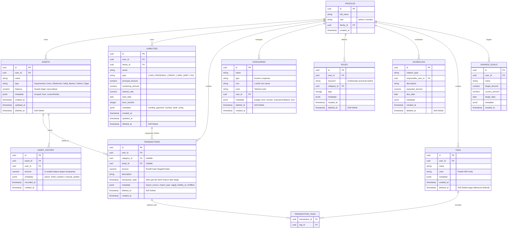

# Mimari: Faz 0-1 — Temel Altyapı ve Veritabanı

> **Kapsam:** Supabase kurulumu, tüm tablo şemaları, Row Level Security politikaları, Soft Delete mekanizması ve Asset History motoru.

---

## 1. Veritabanı Şeması (Tam ER Diyagramı)



---

## 2. Temel Mimari Prensipler

### 2.1 Soft Delete (Kural: Hiçbir Finansal Veri Silinmez)

Fiziksel `DELETE` işlemi tüm ana tablolarda **yasaktır**. Bunun yerine:

```sql
-- Her silme işlemi şu şekilde yapılır:
UPDATE transactions SET deleted_at = NOW() WHERE id = $1;

-- Her sorgu şu filtreyi içerir:
SELECT * FROM transactions WHERE deleted_at IS NULL;
```

**Kapsam:** `transactions`, `assets`, `categories`, `rules`, `schedules`, `liabilities`, `tags`

**tags tablosu notu:** Etiket silindiğinde önce `transaction_tags` junction tablosundan ilişki kaldırılır (fiziksel silme — referential integrity), ardından `tags` tablosuna soft delete uygulanır.

---

### 2.2 Metadata JSONB — Extensibility First

Her ana tabloda `metadata jsonb` kolonu zorunludur. Bu sayede **şema değişikliği yapmadan** yeni özellik eklenebilir:

```typescript
// Örnek metadata kullanımları:
metadata: {
  // categories tablosunda:
  budget_limit: 5000,           // Aylık bütçe limiti
  isSystemFallback: true,        // "Diğer" sistem kategorisi mi?
  
  // transactions tablosunda:
  import_source: "Kitap1.xlsx",  // Hangi dosyadan geldi?
  import_type: "EXPENSE",        // INCOME | EXPENSE (import sırasında tespit)
  import_adapter: "İş Bankası",  // Hangi banka adaptörü kullandı?
  tags: ["Market", "Gıda"],      // Junction table ile senkronizasyon
  liability_id: "uuid",          // Borç ödemesi ilişkilendirmesi
  isOffline: true,               // PWA offline queue'dan geldi mi?
  
  // assets tablosunda:
  isLiquid: true,                // Safe-to-Spend hesabına dahil edilsin mi?
  
  // asset_history tablosunda:
  action: "manual_update",       // Neden bu snapshot alındı?
}
```

---

### 2.3 Immutable Asset History

`asset_history` tablosu **salt okunur snapshot** deposudur:

```typescript
// createAsset çağrıldığında otomatik ilk snapshot:
await supabase.from('asset_history').insert({
  asset_id: newAsset.id,
  amount: newAsset.balance,
  user_id: targetUserId,
  metadata: { action: 'initial_creation' }
});

// updateAsset ile bakiye değiştiğinde yeni snapshot:
if (updates.balance !== undefined) {
  await supabase.from('asset_history').insert({
    asset_id: id,
    amount: updates.balance,
    metadata: { action: 'manual_update' }
  });
}
```

**Kural:** `asset_history` tablosuna **sadece INSERT** yapılır. UPDATE/DELETE kesinlikle yasak.

---

## 3. Güvenlik (Row Level Security)

Supabase RLS ile her kullanıcı sadece kendi verisini görebilir:

```sql
-- Örnek: transactions tablosu için RLS:
CREATE POLICY "Kullanici kendi islemlerini gorur"
  ON transactions FOR ALL
  USING (auth.uid() = user_id);

-- Kategori paylaşımı (aile grubu):
CREATE POLICY "Aile kategorilere erisebilir"
  ON categories FOR SELECT
  USING (user_id IS NULL OR user_id = auth.uid() OR
         EXISTS (SELECT 1 FROM profiles WHERE id = auth.uid() AND family_id = ...));
```

**Dev-Mode Bypass:** Faz 14'e kadar `NEXT_PUBLIC_MANUAL_PROFILE_ID` env değişkeni ile auth'suz erişim sağlanır. Bu değişken tanımlıysa sistem gerçek auth yerine bu ID'yi kullanır.

---

## 4. Supabase İstemci Yapılandırması

```typescript
// src/lib/supabase.ts
// Her bileşende aynı client örneği kullanılmaz; her çağrı yeni createClient() üretir.
// Bu Next.js App Router'ın SSR/CSR ayrımını güvenli şekilde yönetmesini sağlar.

export function createClient() {
  return createBrowserClient(
    process.env.NEXT_PUBLIC_SUPABASE_URL!,
    process.env.NEXT_PUBLIC_SUPABASE_ANON_KEY!
  );
}
```

**Env Değişkenleri (.env.local):**
- `NEXT_PUBLIC_SUPABASE_URL` — Supabase proje URL'si
- `NEXT_PUBLIC_SUPABASE_ANON_KEY` — Public erişim anahtarı
- `NEXT_PUBLIC_MANUAL_PROFILE_ID` — Dev bypass UUID

---

## 5. Yazılmayı Bekleyen Altyapı (Açık Görevler)

| Görev | Faz | Açıklama |
|-------|-----|---------|
| Storage Bucket | 1.11 | `receipts` ve `asset_docs` bucket kurulumu |
| Storage RLS | 1.11 | User bazlı erişim politikaları |
| Digital Vault Upload | 4.5 | FileUploader → Storage entegrasyonu |
| Snapshot Trigger | 4.6 | DB tetikleyici ile otomatik history kaydı |
| Formal Auth | 14.1 | Login/Register ekranı, bypass kaldırma |
| Auto Profile Trigger | 14.2 | Auth sonrası otomatik profil satırı |
