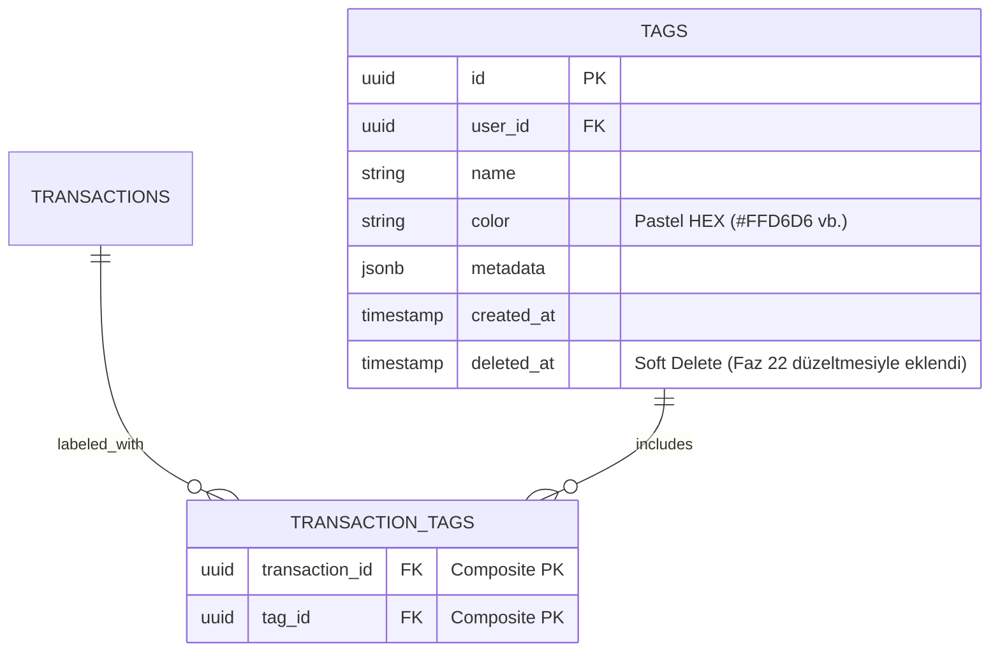

# Mimari: Faz 22 — Etiket Yönetimi (Tag Management)

> **Kapsam:** Kategori bağımsız etiket sistemi, junction table, TagPicker bileşeni, toplu etiketleme, merge/silme mantığı ve metadata senkronizasyonu.

---

## 1. Etiket Sistemi — Tasarım Felsefesi

Etiketler, kategorilerden **tamamen bağımsız** bir boyutsal analiz katmanıdır:

| | Kategori | Etiket |
|--|---------|--------|
| Zorunluluk | Evet (her işlem bir kategoride) | Hayır (opsiyonel) |
| Sayı | 1 (tek kategori) | N (çoklu etiket) |
| Scope | Gelir/Gider tipi | Tematik gruplama |
| Örnek | "Market" | #tatil, #egitim, #aile |

**Örnek:** Tatil için "Ulaşım" kategorisinde yapılan uçak bileti harcaması hem `Ulaşım` kategorisinde hem `#tatil` etiketinde görünür. Böylece tatil maliyeti tüm kategorileri kesen bir etiket raporu olarak analiz edilebilir.

---

## 2. Veri Modeli



### Çift Kayıt Stratejisi (İki Katman Senkronizasyonu)

| Katman | Tablo | Format | Kullanım |
|--------|-------|--------|---------|
| **Junction Table** | `transaction_tags` | UUID ilişkisi | DB analitik sorguları |
| **Metadata Cache** | `transactions.metadata.tags` | `string[]` isim dizisi | UI hızlı render, RuleEngine |

Her etiket atama/kaldırma işleminde **her iki katman** güncellenir.

---

## 3. Servis Katmanı API — financeService.ts

### createTag
```typescript
financeService.createTag({ name, color, metadata })
// → user_id otomatik eklenir
// → tags tablosuna INSERT
```

### deleteTag (Merge Destekli)
```typescript
financeService.deleteTag(id, mergeToTagId?)

// 1. mergeToTagId varsa:
//    a. transaction_tags'te eski tag_id → yeni tag_id güncelle
//    b. transactions.metadata.tags[] içinde eski isim → yeni isim güncelle
//
// 2. transaction_tags'ten eski etiketi sil (referential integrity)
//
// 3. tags tablosuna SOFT DELETE (deleted_at = now())
//    NOT: Fiziksel DELETE değil — veri geçmişi korunur
```

### linkTransactionsToTags
```typescript
financeService.linkTransactionsToTags(transactionIds, tagNamesOrIds)

// İsim veya UUID kabul eder:
const isUUID = /^[0-9a-f-]{36}$/.test(input[0]);
if (!isUUID) {
  // İsimden ID'ye çevir (Supabase lookup)
}

// 1. Mevcut ilişkileri temizle (duplicate önleme)
// 2. Yeni ilişkileri junction table'a INSERT
// 3. Metadata cache güncelle (metadata.tags[])
```

---

## 4. Store Katmanı — useFinanceStore

```typescript
// Tag CRUD:
addTag(tag)           → financeService.createTag()
updateTag(id, updates) → financeService.updateTag()
deleteTag(id, mergeId) → financeService.deleteTag()

// Toplu etiketleme:
addTagsToTransactions(transactionIds, tagIds)
  → financeService.linkTransactionsToTags()
  → fetchFinanceData() ile tam yenileme (metadata güncellemesi için)

// Persist:
// tags[] localStorage'a yazılır — offline'da etiketler kaybolmaz
```

---

## 5. UI Entegrasyon Noktaları

### 5.1 TagPicker (Molecule Bileşeni)

`src/components/molecules/TagPicker.tsx`

```
TagPicker
├── Mevcut etiketleri listeler (tags store)
├── Pastel renk badge'leri gösterir
├── Çoklu seçime izin verir
└── onChange(selectedTagNames[]) callback'i ile parent'a bildirir
```

**Kullanıldığı yerler:**
- `TransactionForm` — Manuel işlem girişinde etiket atama
- `ImportPreviewModal` — Her satır için etiket seçimi
- `BulkActionBar` — Toplu etiketleme işlemi

### 5.2 TransactionRow (Molecule)

Her işlem satırında etiketler pastel renk `Badge` olarak gösterilir:
```typescript
// transaction.metadata.tags[] → her isim için renk lookup:
const tag = tags.find(t => t.name === tagName);
const color = tag?.color || '#E2E8F0'; // fallback gri
```

### 5.3 TransactionList Filtreleme

İşlem listesinde etiket filtresi:
```typescript
// Arama motoru etiket isimlerini de kapsar:
const matchesSearch = 
  tx.description.includes(search) ||
  (tx.metadata?.tags || []).some(tag => tag.includes(search));
```

---

## 6. Tag Management Sayfası

`/settings/tags` (Route: `src/app/settings/tags/`)

```
Etiket Yönetimi
├── Tüm etiketlerin tablo/grid görünümü
├── Her satır: İsim | Renk | Kullanım Sayısı
├── Yeni Etiket Formu (İsim + Pastel Color Picker)
├── Düzenleme: İnline edit
└── Silme → Merge Dialog
    ├── "Sadece Kaldır" — İşlemlerden etiket silinir
    └── "Birleştir" — Başka etikete taşı (dropdown seçimi)
```

### 6.1 Etiket Detay ve Analiz Sayfası (Analytical View)

`/tags/detail?id=TAGID` (Route: `src/app/tags/detail/page.tsx`)

Bir etikete (Örn: `#tatil`) tıklandığında ulaşılan detaylı Dashboard paneli:
- **Kullanım Trendi (Trend Chart):** İlgili etiketin son 6 ay içindeki kullanım sıklığı (Total Spending by Tag). `AnalyticsEngine.getTagTrend` servisi ile hesaplanır.
- **Kategori Dağılımı (Distribution Pie Chart):** Etiketin altında yer alan işlemlerin kategorilere göre ağırlığını gösteren pasta grafik. `AnalyticsEngine.getTagCategoryDistribution` servisi ile hesaplanır.
- **Popüler Harcama Noktaları (Top Merchants Pie Chart):** Etiketin altında yer alan işlem açıklamalarına (description) göre en sık işlem yapılan ilk 5 harcama noktası ve "Diğer" grubunu gösteren ikinci pasta grafik. `AnalyticsEngine.getMerchantDistribution` servisi ile hesaplanır.
- **Odaklı Liste (Transaction List) ve Tarih Filtresi:** Yalnızca o etikete sahip işlemlerin yer aldığı filtrelenmiş Defter (Ledger) tablosu. Sayfa içerisinde yer alan açılır menü sayesinde (Bu Ay, Geçen Ay, Bu Yıl, Tüm Zamanlar ve Son 12 Ay) spesifik zaman dilimlerine indirgenebilir. UI bileşeni beyaz arka plan hatası giderilmiş özel `bg-slate-950` teması ile sunulur.

---

## 7. Kategori-Etiket Matris Analizi (Faz 22.5)

Belirli bir etikete basıldığında açılan `Analytical View` içerisinde yer alan **Kategori Dağılımı (Pie Chart)** ile kısmen karşılanmıştır. Kullanıcı, seçtiği etiketin hangi kategorilerde ne kadar ağırlığa sahip olduğunu detay panelinde pasta grafik ve oransal listede görebilir.

---

## 8. Pastel Renk Paleti

Etiketler kategorilerle karışmaması için pastel tonlar kullanır:

| Renk | HEX Örneği | Anlamı |
|------|-----------|--------|
| Pembe | `#FFD6D6` | Kişisel |
| Sarı | `#FFF3CD` | Tatil/Eğlence |
| Yeşil | `#D4EDDA` | Tasarruf |
| Mavi | `#D1ECF1` | Eğitim |
| Mor | `#E8D5F5` | Sağlık |

---

---

## 10. State Senkronizasyonu ve Yükleme Yönetimi (Düzeltme: 14.04.2026)

Toplu etiketleme gibi asenkron işlemlerde `useFinanceStore` üzerindeki `loading` state'i ve veri tazeleme mekanizması aşağıdaki kurallara göre çalışmaktadır:

1.  **Race Condition Önleme**: `fetchFinanceData` fonksiyonu, `loading` state'i `true` iken çağrılırsa (diğer aksiyonların fetch'i bozmaması için) işlem yapmadan döner.
2.  **Aksiyon-Fetch Senkronizasyonu**: `addTagsToTransactions` gibi aksiyonlar, API çağrısı bittikten hemen sonra `set({ loading: false })` yaparak kilidi açmalı ve ardından `fetchFinanceData(true)` (force=true) çağırarak verilerin güncellenmesini garanti altına almalıdır.
3.  **UI Feedback**: `BulkActionBar` üzerindeki "Etiketleri Uygula" butonu, store'daki her iki `loading` durumunu (hem aksiyon hem fetch) takip ederek spinner gösterir ve butonu deaktive eder.
