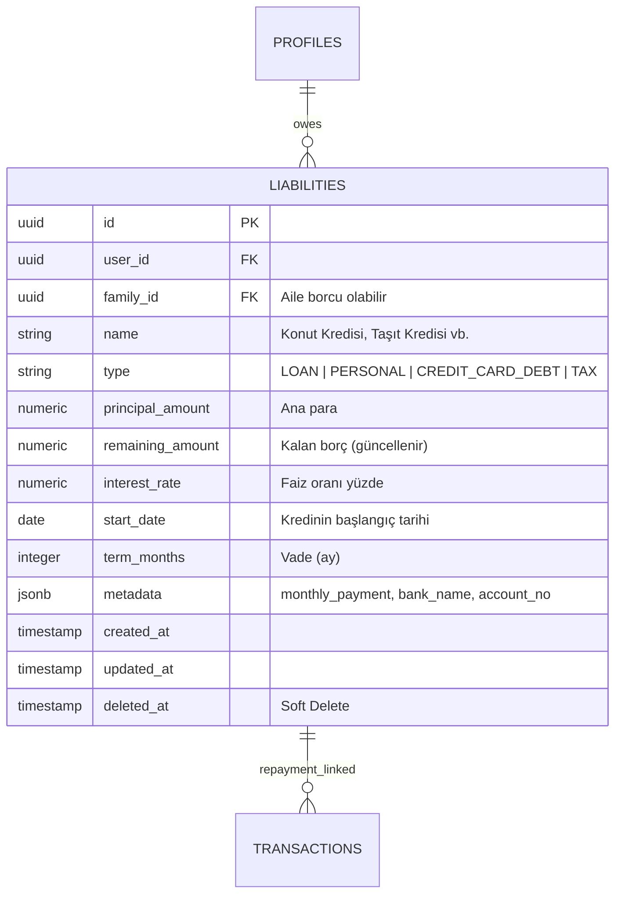

# Mimari: Faz 23 & 24 — Borç Yönetimi ve Oracle Tahminleme Motoru

> **Kapsam:** Liabilities şeması, amortizasyon hesaplama, borç-işlem ilişkilendirme, otomatik bakiye düşürme motoru, UI giriş noktaları ve ForecastEngine detayları.

---

## 1. Liabilities — Borç/Yükümlülük Şeması



### Borç Tipleri

| Tip | Açıklama |
|-----|---------|
| `LOAN` | Banka kredisi (konut, taşıt, ihtiyaç) |
| `PERSONAL` | Kişiler arası borç |
| `CREDIT_CARD_DEBT` | Kredi kartı borcu |
| `TAX` | Vergi yükümlülüğü |

---

## 2. Borç Ödeme Takibi — Transaction Bağlantısı

Bir kredi taksiti ödendiğinde, işlem `metadata.liability_id` üzerinden ilgili borca bağlanır:

```typescript
// İşlem kaydedilirken (UI: TransactionForm üzerinden "Bu bir borç ödemesi mi?" toggle'ı açıkken):
const transaction = {
  amount: -2850,   // Taksit/Ödeme tutarı (gider = negatif)
  description: "Konut Kredisi Taksit - Ocak 2026",
  category_id: categories.find(c => c.name === 'Kredi Ödemesi')?.id,
  metadata: {
    liability_id: "konut-kredisi-uuid",  // Bağlantı burada
  }
};

// Auto-Reduction (Servis Katmanı - Faz 23.6):
// Yukarıdaki transaction eklendiğinde `financeService.createTransaction`:
// 1. Transaction'ı kaydeder
// 2. Eğer `amount < 0` ve `liability_id` varsa:
//    `liabilities.remaining_amount` değerini `amount` kadar azaltarak borcu günceller.
//
// 3. Silme & Geri Alma (Revert): Eğer bir işlem `deleteTransaction` veya `bulkDeleteTransactions`
//    ile silinirse, arka planda bağlanmış olan liability/receivable kaydı tespit edilip
//    düşürülmüş bakiye tekrar eski haline döndürülür (restore). 
//
// Bu mantık merkezi bir yardımcı metota alınmıştır:
financeService._internalReduceLiability(liabilityId, amount)
// → Hem createTransaction, bulkCreateTransactions hem de linkTransactionsToRelation bu metodu çağırır.
// → Böylece Manuel giriş, Ekstre İçe Aktarım, ve Geriye Dönük Bağlama akışlarında tutarlılık sağlanır.
```

### Borç İlişkilendirme — UI Giriş Noktaları

Kullanıcı bir borç ödemesini **3 farklı noktadan** sisteme girebilir:

| Giriş Noktası | Ekran | Nasıl? |
|---|---|---|
| **Dashboard Formu** | `/` (Ana Sayfa) | `TransactionForm` → "Bu bir borç ödemesi mi?" toggle |
| **İşlem Defteri** | `/transactions` | "Manuel İşlem Ekle" butonu → `TransactionForm` Dialog |
| **İşlemler (Toplu İşlem)**| `/transactions` | Cehckbox ile Seçim → `BulkActionBar` (Geriye Dönük Toplu Borç/Alacak Bağlama) |
| **Ekstre Yükleme** | `/audit` → Import Modal | Her satırda "Borç Bağla" seçicisi |

### Görsel Belirteçler — TransactionRow

İşlem listesinde bir borca bağlı kayıtların yanında otomatik olarak **"Borç Ödemesi"** rozeti görüntülenir:
```typescript
// TransactionRow.tsx
{(transaction.metadata as any)?.liability_id && (
  <div className="bg-emerald-500/10 text-emerald-500 border border-emerald-500/20 ...">
    <CreditCard className="w-2 h-2" />
    <span>Borç Ödemesi</span>
  </div>
)}

---

## 3. Amortizasyon Hesaplama

`ForecastEngine.ts` içinde basitleştirilmiş amortizasyon:

```typescript
// Aylık taksit tahmini (metadata.monthly_payment yoksa):
const installment = liability.metadata?.monthly_payment ||
                   (liability.principal_amount / (liability.term_months || 12));

// Aylık faizli hesaplama (daha doğru formül — TODO):
// M = P × [r(1+r)^n] / [(1+r)^n - 1]
// M: Aylık taksit, P: Ana para, r: Aylık faiz, n: Vade
```

---

## 4. LiabilityManager Bileşeni

`src/components/organisms/LiabilityManager.tsx` (11KB)

```
LiabilityManager
├── Borç Listesi
│   └── Her borç için Progress Card:
│       ├── İsim ve tip badge'i
│       ├── Kalan borç / Ana para progress bar (% ödendi)
│       ├── Aylık taksit tahmini
│       └── Tahmini bitiş tarihi
├── Yeni Borç Formu
│   ├── İsim, Tip (dropdown)
│   ├── Ana para, Faiz, Vade
│   └── Başlangıç tarihi
└── Borç Silme (→ soft delete)
```

**Net Worth entegrasyonu:**
```typescript
getNetWorth(): number {
  const totalAssets = assets.reduce((sum, a) => sum + a.balance, 0);
  const totalLiabilities = liabilities.reduce((sum, l) => sum + l.remaining_amount, 0);
  return totalAssets - totalLiabilities; // Gerçek net değer
}
```

---

## 5. ForecastEngine — Oracle Engine Detayları

`src/services/ForecastEngine.ts`

### Başlangıç Bakiyesi Tespiti

```typescript
const liquidBalance = assets
  .filter(a => a.type === 'Nakit/Banka' || a.metadata?.isLiquid)
  .reduce((sum, a) => sum + (a.balance || 0), 0);
```

### 180 Günlük Projeksiyon Döngüsü

```typescript
for (let i = 0; i <= 180; i++) {
  const date = addDays(today, i);
  let dayIncome = 0, dayExpense = 0;

  // A. Sabit Ödemeler (Schedules):
  schedules.forEach(s => {
    if (new Date(s.due_date).getDate() === date.getDate()) {
      const amount = s.expected_amount || 0;
      amount > 0 ? dayIncome += amount : dayExpense += Math.abs(amount);
    }
  });

  // B. Borç Taksitleri:
  liabilities.forEach(l => {
    const payDay = new Date(l.start_date).getDate();
    if (payDay === date.getDate() && l.remaining_amount > 0) {
      dayExpense += l.metadata?.monthly_payment ||
                   (l.principal_amount / (l.term_months || 12));
    }
  });

  // C. Değişken Günlük Harcama (son 30 günün ortalaması):
  dayExpense += dailyAverageSpending;

  runningBalance += (dayIncome - dayExpense);
  projection.push({ date, balance: runningBalance, ... });
}
```

---

## 6. OracleChart Bileşeni

`src/components/organisms/OracleChart.tsx` (8KB)

```typescript
// Önemli: Hook Sıralaması Güvenlik Kuralı
// Hydration kontrolü conditional return'dan ÖNCE yapılmalı

// ❌ YANLIŞ:
if (!isHydrated) return null;
const data = useMemo(() => getForecastData(), [transactions]);  // Hook sırası değişir!

// ✅ DOĞRU:
const data = useMemo(() => getForecastData(), [transactions]);  // Hook önce
if (!isHydrated) return null;                                    // Sonra return
```

**Bu kural ihlallendiğinde:**  
`React Error: Rendered more hooks than during the previous render`

### OracleChart Görsel Özellikleri

- Recharts `ComposedChart` (AreaChart + ReferenceLine)
- Negatif bakiye bölgesi kırmızı gradient ile gösterilir
- `detectLowBalanceRisks()` ile riskli noktalar tespit edilir
- Bugün çizgisi `ReferenceLine` ile işaretlenir

---

## 7. Low Balance Alert Sistemi

```typescript
forecastEngine.detectLowBalanceRisks(projection, threshold = 0)
// → Bakiyenin 0'ın altına düştüğü tarih noktaları

// UI'da:
const risks = detectLowBalanceRisks(forecastData);
if (risks.length > 0) {
  // "⚠️ Bakiyeniz X tarihinde eksiye düşebilir" uyarısı
}
```

---

## 8. Net Worth Widget — Dashboard

```
Toplam Net Değer = Toplam Varlıklar - Toplam Borçlar

Varlıklar: assets[].balance toplamı
Borçlar: liabilities[].remaining_amount toplamı

StatsSummary bileşeninde gösterilir.
```

---

## 9. Güvenlik ve Veri Bütünlüğü

| Kural | Uygulama |
|-------|---------|
| Soft Delete | `liabilities.deleted_at` — `getLiabilities()` filtresi |
| Aile Borcu | `family_id` desteği şemada mevcut |
| RLS | Borçlar `user_id` bazlı izole |
| Metadata | Banka adı, hesap numarası şema bozulmadan `metadata`'ya |
| Immutable History | Borç sahip asset'lerin history'si `asset_history`'de |
| Borç Bakiye Tutarlılığı | `_internalReduceLiability` tek noktadan çağrılır; manual ve bulk import'ta aynı mantık çalışır |

---

## 10. Görev Tamamlanma Tablosu (Faz 23)

| Görev ID | Açıklama | Durum |
|----------|----------|-------|
| 23.1-23.4 | Liabilities CRUD + UI | ✅ |
| 23.5 | TransactionForm'a Borç Seçicisi UI | ✅ |
| 23.5+ | BulkActionBar ile Geriye Dönük Borç Bağlama UI | ✅ |
| 23.6 | Otomatik Bakiye Düşürme (createTransaction) | ✅ |
| 23.6+ | Borç Silmede (deleteTransaction) Bakiye Restore Etme | ✅ |
| 23.6+ | `_internalReduceLiability` Yardımcı Metot | ✅ |
| 23.6+ | `bulkCreateTransactions`'a Bakiye Düşürme | ✅ |
| 23.6+ | İşlemler Sayfası "Manuel Ekle" Dialog | ✅ |
| 23.6+ | ImportPreviewModal'a "Borç Bağla" Seçicisi | ✅ |
| 23.6+ | TransactionRow "Borç Ödemesi" Rozeti | ✅ |
