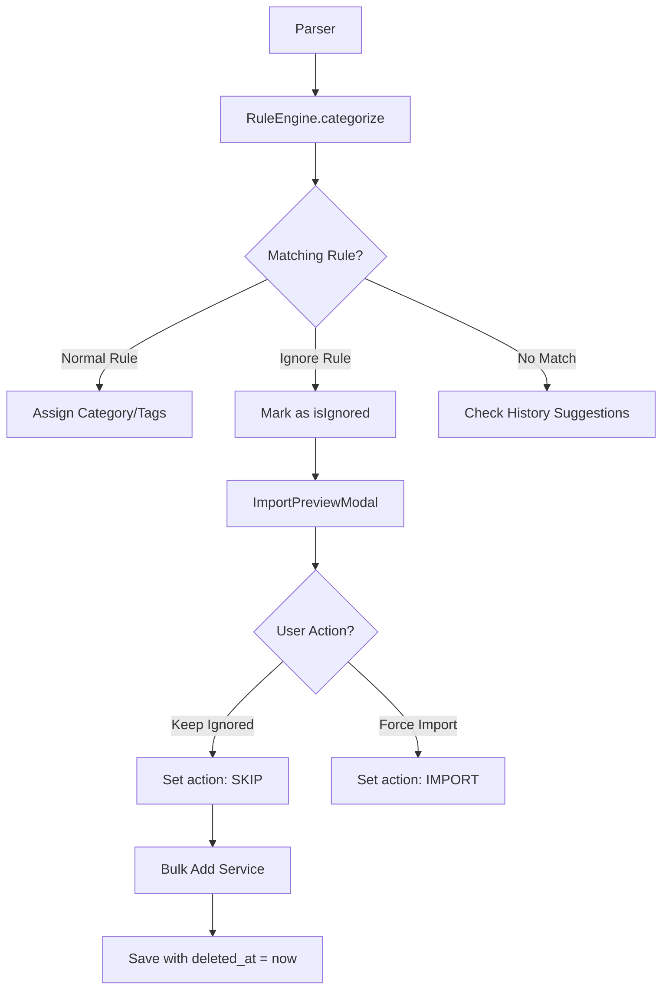

# Mimari: Faz 25 — Akıllı Filtreleme ve Otomatik Durum Yönetimi

> **Kapsam:** İstenmeyen işlemlerin (blacklist) otomatik elenmesi, "Ignore" kuralları, önizleme ekranında görsel ayrıştırma ve akıllı kural önerileri.
>
> **Durum:** ✅ Tüm mikro görevler tamamlandı (Faz 25.1–25.5)

---

## 1. Veri Yapısı ve Ignore Mantığı

### Ignore Kuralları
"Yoksay" (Ignore) kuralları, mevcut `rules` tablosunda saklanır. Ayrım için `metadata` içindeki `is_ignore` bayrağı kullanılır.

- **Tablo:** `public.rules`
- **Alan:** `metadata -> 'is_ignore': boolean`
- **Davranış:** Eğer bir kural `is_ignore: true` ise, `category_id` null olabilir ve bu kural eşleştiğinde işlem "Yoksayılan" olarak işaretlenir.

### Yoksayılan İşlemlerin DB Durumu
Kullanıcı kararı gereği, yoksayılan işlemler veritabanına kaydedilir ancak **Soft Delete** mantığıyla (`deleted_at` set edilerek) saklanır.

- **Status:** `metadata -> 'status': 'ignored'`
- **Visibility:** `deleted_at IS NOT NULL` olduğu için normal listelerde ve istatistiklerde görünmez.
- **Purpose:** Veri bütünlüğü, yanlışlıkla silinenleri geri getirme ve "Temizlik Servisi" için veri sağlama.

---

## 2. Status Engine & Filtreleme Akışı



---

## 3. Uygulanan Bileşenler ve Dosyalar

### 25.1 — Ignore Rules UI (Kara Liste Sekmesi)
**Dosya:** `src/app/audit/page.tsx`

`audit` sayfasına Tab sistemi eklendi:
- **Sekme 1 — Akıllı Kurallar:** Normal `is_ignore: false` kuralları (kategori atamalı)
- **Sekme 2 — Kara Liste:** Yalnızca `is_ignore: true` kuralları

**Kara Liste Özellikleri:**
- Keyword-only hızlı ekleme formu (kategori seçimi yok)
- Rosé tema: `rose-500/5` arka plan, `EyeOff` + `Ban` ikonları
- Bilgi kartı: Kara liste davranışını açıklayan inline açıklama
- Boş durum UI'ı: Örnek kullanım senaryoları
- Sistem Durumu panelinde ayrı sayaç: `X Kara Liste Kaydı`
- Sağ panel İpuçları kartı: Kural türlerini açıklayan rehber

**Tab UI Mimarisi:**
```typescript
type ActiveTab = 'all-rules' | 'blacklist';

const normalRules  = rules.filter(r => !r.metadata?.is_ignore);
const blacklistRules = rules.filter(r => !!r.metadata?.is_ignore);
```

### 25.2 — Pre-Import Filter Logic
**Dosya:** `src/services/RuleEngine.ts` + `src/components/organisms/ImportPreviewModal.tsx`

```typescript
// RuleEngine.categorize() dönüş değeri:
{ category_id: string | undefined; tags: string[]; is_ignore: boolean }

// ImportPreviewModal entry initialization:
isIgnored: !!is_ignore,
action: (duplicateTx || is_ignore) ? 'SKIP' : 'IMPORT'
```

### 25.3 — Auto-Inactivate UI
**Dosya:** `src/components/organisms/ImportPreviewModal.tsx` — satır 322, 326

```tsx
// Yoksayılan satırlar görsel ayrıştırma:
entry.isIgnored && entry.action === 'SKIP' && "opacity-40"

// Badge:
{entry.isIgnored && entry.action === 'SKIP' && (
  <Badge>Yoksayıldı</Badge>
)}
```

### 25.4 — Learning Shortcuts
**Dosya:** `src/components/organisms/ImportPreviewModal.tsx` — satır 391–410

```tsx
// Kullanıcı bir işlemi SKIP yaptığında inline öneri:
{!entry.isIgnored && entry.action === 'SKIP' && !entry.isDuplicate && (
  <button onClick={() => {
    addRule({ keyword: ..., metadata: { is_ignore: true } });
    // Entry isIgnored: true olarak güncellenir
  }}>
    BUNU HEP YOKSAY?
  </button>
)}
```

### 25.5 — Clean-up Service
**Dosya:** `src/services/financeService.ts` + `src/store/useFinanceStore.ts`

```typescript
// financeService.cleanupIgnoredTransactions()
// metadata->>'status' = 'ignored' AND deleted_at IS NOT NULL olanları fiziksel siler

// Tetikleyici: audit/page.tsx → "Yoksayılanları Temizle" butonu
```

---

## 4. UI/UX Prensipleri

### Kara Liste Sekmesi (25.1)
- Kara liste kayıtları **rosé (gül) renk** temayla normal kurallardan ayrışır
- `Tab sayısı` badge'leri sekme başlığındaki sayaçlarda anlık güncellenir
- `EyeOff` ve `Ban` ikonları tutarlı kullanılır (sistem genelinde)
- Hızlı ekleme: Sadece keyword yazıp Enter → `is_ignore: true` kural oluşur

### Import Preview (Önizleme)
- **Görsel Geri Bildirim:** Yoksayılan satırlar `opacity-40` ve strikethrough ile gösterilir.
- **Default Action:** `SKIP` (Atla).
- **Badge:** "Yoksayıldı" etiketi eklenir.
- **"BUNU HEP YOKSAY?"** Butonu: İnline öğrenme kısayolu.

### Rule Management (Kural Yönetimi)
- **Toggle:** Kural formunda "Otomatik Yoksay" checkbox → kategori alanını devre dışı yapar
- **Liste:** Ignore kuralları `EyeOff` ikonu ile diğerlerinden ayrılır
- **Düzenleme (Edit):** Mevcut kurallar Keyword ve Kategori bazında güncellenebilir

---

## 5. Akıllı Kısayollar (Learning Shortcuts)

Kullanıcı `ImportPreviewModal` içinde bir işlemi manuel olarak SKIP yaptığında:
1. Sistem benzer açıklamaya sahip başka işlemler olup olmadığını kontrol eder.
2. Kullanıcıya inline öneri sunar: *"Bu işlemi yoksaydınız. Gelecekte '[Anahtar Kelime]' içerenleri otomatik mi yoksayalım?"*
3. Onaylanırsa otomatik olarak yeni bir `is_ignore: true` kuralı oluşturulur → Kara Liste'ye düşer.

---

## 6. Temizlik Servisi (Clean-up Service)

- **Mantık:** Kullanıcı isteğiyle `metadata->>'status' = 'ignored'` olan ve soft-delete yapılmış kayıtlar fiziksel olarak silinir.
- **Tetikleyici:** `AuditPage` sağ panelindeki "Yoksayılanları Temizle" butonu.
- **Dosya:** `financeService.cleanupIgnoredTransactions()` ve `useFinanceStore.cleanupIgnoredTransactions()`.

---

## 7. Teknik Yönetişim (Technical Governance)

### Hybrid Veri Yönetimi
Uygulama hem çevrimiçi (Supabase) hem çevrimdışı (Local Mode) çalışabildiği için `financeService` katmanında aşağıdaki protokol uygulanır:
- **Local IDs:** Yerel olarak oluşturulan kayıtlar `local-` ön ekiyle tanımlanır.
- **UUID Validation:** Supabase CRUD işlemleri sırasında ID kontrolü yapılır. Eğer ID `local-` ile başlıyorsa, DB isteği atlanarak Postgres "invalid input syntax for type uuid" hatası önlenir.
- **Consistency:** Yerel veriler Zustand Store (Persist) üzerinden yönetilir, DB verileri refetch ile senkronize edilir.

---

---

## 9. Manuel Filtreleme ve Tutar Aralığı (Düzeltme: 14.04.2026)

Kullanıcıların işlem listesini manuel olarak daraltabilmesi için Defter (Transactions) sayfasına gelişmiş filtreleme özellikleri eklenmiştir:

### 9.1 Tutar Aralığı Filtresi (Amount Range)
- **Mantık:** Kullanıcı tarafından girilen Min. ve Max. tutar değerleri, işlemlerin **mutlak değeri (absolute value)** üzerinden karşılaştırılır.
- **Kapsam:** Hem gelirler hem de giderler (işaret gözetmeksizin büyüklük bazlı) aynı filtreye tabidir.
- **UI:** Filtreleme sekmesine iki adet sayısal girdi alanı (`Input type="number"`) eklenmiştir.
- **Entegrasyon:** `TransactionList` bileşeni `minAmount` ve `maxAmount` parametrelerini alarak istemci tarafında anlık filtreleme yapar. `handleExport` (CSV Dışa Aktar) fonksiyonu bu filtreleri dikkate alarak sadece görünür verileri dışa aktarır.
