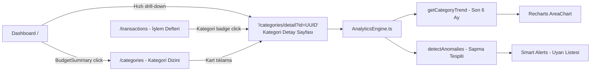

# Mimari: Faz 26 — Category Insights & Drill-down Analizi

> **Kapsam:** Dashboard'dan kategori bazlı derin analize geçiş (drill-down), AnalyticsEngine, anomali tespiti ve query param route mimarisi.

---

## 1. Analiz Hiyerarşisi ve Navigasyon Akışı



---

## 2. Route Mimarisi — Static Export Uyumu

### Problem ve Çözüm

```
❌ PROBLEM: /src/app/categories/[id]/page.tsx
   → Next.js output: 'export' modunda generateStaticParams() zorunlu
   → Dinamik UUID listesi build time'da bilinmiyor
   → BUILD FAILED

✅ ÇÖZÜM: /src/app/categories/detail/page.tsx + ?id=UUID query param
   → Statik bir sayfa, dinamik içerik URL'den okunuyor
   → Capacitor uyumlu, build sorunsuz
```

### Uygulama

```typescript
// /src/app/categories/detail/page.tsx
'use client';

// CategoryDetailClient.tsx içinde:
const searchParams = useSearchParams();
const categoryId = searchParams.get('id');  // URL'den al

// Link oluşturma (tüm bileşenlerde):
<Link href={`/categories/detail?id=${category.id}`}>

// Etkilenen bileşenler:
// - BudgetSummary.tsx → progress bar linki
// - TransactionRow.tsx → kategori badge'i linki
// - CategoriesIndexPage → kart linki
// - Dashboard page.tsx → quick link
```

---

## 3. AnalyticsEngine — Hesaplama Motoru

`src/services/AnalyticsEngine.ts`

Performance notu: `useMemo` içinde çalıştırılır — gereksiz render önlenir.

### getCategoryTrend(categoryId, transactions)

```typescript
// Son 6 ayın aylık harcama toplamı:
for (let i = 5; i >= 0; i--) {
  const yearMonth = `${year}-${month}`;
  monthlyGroups[yearMonth] = 0; // Eksik aylar için sıfır doldurma
}

// İşlemler filtrelenir ve gruplandırılır:
categoryTxs.forEach(tx => {
  monthlyGroups[yearMonth] += Math.abs(tx.amount);
});

// Recharts AreaChart için format:
return [{ month: 'Oca', amount: 1250, yearMonth: '2026-01' }, ...]
```

### detectAnomalies(categoryId, transactions)

**İki anomali türü tespiti:**

| Tür | Kural | Severity |
|-----|-------|----------|
| `SPIKE` | İşlem tutarı, kategori ortalamasının **2.5x**'ini ve 500₺'yi aşıyorsa | `medium` (`5x` ise `high`) |
| `MONTHLY_SPIKE` | Bu ayın toplam harcaması geçen ayın **%150**'sini aşıyorsa | `medium` (`200%` ise `high`) |

```typescript
// Örnek SPIKE tespiti:
const averageTxAmount = amounts.reduce((a, b) => a + b) / amounts.length;
if (amount > averageTxAmount * 2.5 && amount > 500) {
  anomalies.push({
    type: 'SPIKE',
    severity: amount > averageTxAmount * 5 ? 'high' : 'medium',
    description: `"${tx.description}" işlemi ortalamanın çok üzerinde`,
    amount, date, txId
  });
}
```

---

## 4. Kategori Detay Sayfası — Bileşen Yapısı

`/src/app/categories/detail/`

```
CategoryDetailClient.tsx
├── Başlık: Kategori adı + icon + renk
│
├── İstatistik Kartları (3'lü grid):
│   ├── Bu Ay Harcandı (₺)
│   ├── Toplam İşlem Sayısı
│   └── İşlem Başı Ortalama (₺)
│
├── Trend Grafiği (Son 6 Ay)
│   └── Recharts AreaChart
│       └── analyticsEngine.getCategoryTrend(id, transactions)
│
├── Popüler Harcama Noktaları (Top Merchants - Pie Chart):
│   └── İlgili kategorideki en çok harcama yapılan 5 yerin dağılımı
│
├── Bütçe Performansı
│   ├── BudgetProgressBar
│   └── "Ay sonu tahminî: ₺X harcarsın" (Velocity bazlı)
│
├── Smart Alerts (Anomali Uyarıları)
│   └── analyticsEngine.detectAnomalies(id, transactions)
│       ├── 🔴 HIGH: Kritik sapma
│       ├── 🟡 MEDIUM: Dikkat gerektiren sapma
│       └── 🟢 LOW: Bilgilendirme
│
└── Bu Kategorideki İşlemler (Filtrelenmiş Liste)
    ├── Tarih Filtresi: (Bu Ay, Geçen Ay, Bu Yıl, Tüm Zamanlar + Son 12 Ay Seçimi)
    ├── UI: bg-slate-950 dark theme dropdown (fix white background)
    └── transactions.filter(t => t.category_id === id)
```

---

## 5. Kategori Dizini Sayfası (/categories)

`src/app/categories/page.tsx` (8KB)

```typescript
// categoryStats hesabı:
const categoryStats = categories
  .filter(c => c.type === 'expense')
  .map(cat => ({
    ...cat,
    spent: allTxs.reduce((sum, t) => sum + Math.abs(t.amount), 0), // TÜM ZAMANLAR
    count: allTxs.length,                                            // TÜM ZAMANLAR
    status: burnRates.find(br => br.categoryId === cat.id)?.status   // BU AY KİNETİĞİ
  }))
  .sort((a, b) => b.spent - a.spent);
```

**Önemli Fark:**
- `spent` → Tüm zamanlar kümülatif tutar (genel sıralama için)
- `status` → Bu aya ait burn rate (alarm seviyesi için)

---

## 6. State Yönetimi Stratejisi

```typescript
// useFinanceStore içinde proxy fonksiyonlar:
getCategoryTrend: (categoryId) => {
  const { analyticsEngine } = require('@/services/AnalyticsEngine');
  return analyticsEngine.getCategoryTrend(categoryId, get().transactions);
}

getCategoryAnomalies: (categoryId) => {
  const { analyticsEngine } = require('@/services/AnalyticsEngine');
  return analyticsEngine.detectAnomalies(categoryId, get().transactions);
}

// Bileşende kullanım:
const trend = useFinanceStore(s => s.getCategoryTrend(categoryId));
const anomalies = useFinanceStore(s => s.getCategoryAnomalies(categoryId));
```

**Not:** `require()` kullanımı CommonJS import'u. ES Module `import` ile değiştirilebilir ama mevcut yapıda çalışıyor.

---

## 7. Performance Optimizasyonu

- `analyticsEngine` fonksiyonları `useMemo` içinde çalıştırılır
- `transactions` listesi değişmediği sürece hesaplama tekrar yapılmaz
- Kategori sayfası `useEffect` ile `fetchFinanceData()` çağırır — mount'ta tek seferlik yükleme

---

## 8. Açık Geliştirme Noktaları

| Özellik | Durum | Notlar |
|---------|-------|--------|
| `/categories/[id]` → `/categories/detail?id=` | ✅ Tamamlandı | Static export uyumlu |
| Kategori trend grafiği | ✅ Tamamlandı | Son 6 ay, boş ay= 0 |
| Anomali tespiti | ✅ Tamamlandı | SPIKE + MONTHLY_SPIKE |
| Drill-down linkler | ✅ Tamamlandı | BudgetSummary, TransactionRow, CategoriesIndex |
| `MISSING_RECURRING` anomali tipi | ⚠️ Tanımlı ama implement edilmedi | Fuar anomaly türü şemada var |
| Kategori oluşturma (Modal) | ✅ Tamamlandı | /categories sayfasında hızlı ekleme |

## 9. Kategori Yönetimi (Category Management)

Faz 26.4 ile "/categories" sayfasına kategori oluşturma yeteneği eklenmiştir.

- **Bileşen:** `Dialog` (Radix UI) tabanlı `DialogContent`.
- **Form Alanları:** İsim (required), Tip (Gider/Gelir), Bütçe Limiti (Optional).
- **Akış:** `addCategory` (useFinanceStore) -> `fetchFinanceData` (refresh).
- **UX:** Form submit edildiğinde modal kapanır, state güncellenir ve kategori listesine anında yansır.

---

## 10. Akıllı Kural Değerlendirme (Smart Re-assignment)

Faz 26.5 ile mevcut işlemlerin kurallara göre tekrar taranması özelliği eklenmiştir.

### Mekanizma
1. **Filtreleme:** Kategorisi olmayan (`null`) veya fallback olan ("Diğer", "Bilinmeyen") işlemler hedeflenir.
2. **Motor:** `RuleEngine.categorize(description)` çağrılır.
3. **Arayüz:** `RuleReassignmentModal` üzerinden eşleşen işlemler (Örn: "MIGROS" -> "Market") kullanıcıya sunulur.
4. **Toplu Güncelleme:** Onaylanan işlemler `bulkUpdateTransactions` ile PostgreSQL'de güncellenir.

### UI Konumlandırma
- `/categories` sayfasında üst barda "System Status" bölümü.
- "Tekrar Kural Ata" butonu.
- "Yoksayılanları Temizle" butonu.
