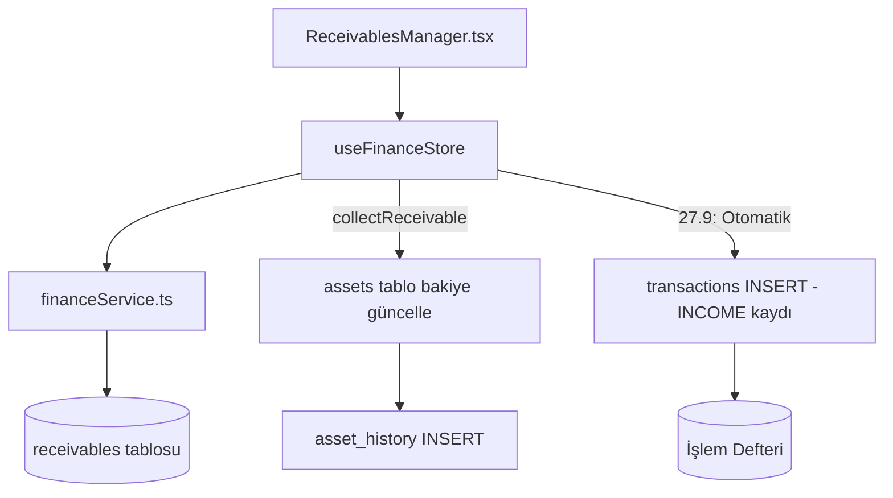

# Mimari: Faz 27 — Alacak Yönetimi (Receivables Tracker)

> **Kapsam:** Kullanıcının başkasına verdiği borçların (alacaklar) yönetimi, kısmi/tam tahsilat akışı, vadesi geçmiş alacakların yaşlandırma raporu ve tahsilat-varlık bağlantısı.

---

## 1. Veri Modeli

### Receivable Interface

```typescript
export interface Receivable {
  id: string
  user_id: string
  debtor_name: string           // Borçlunun adı
  principal_amount: number      // Verilen tutar
  collected_amount: number      // Tahsilatı edilen tutar
  due_date?: string             // Vade tarihi (ISO)
  status: 'PENDING' | 'PARTIAL' | 'COLLECTED'
  asset_id?: string             // Tahsilat hangi hesaba yansıtılacak
  metadata: {
    purpose?: string            // Borç veriliş amacı
    reminder_days?: number      // Hatırlatma periyotu (gün)
    linked_transaction_id?: string
    [key: string]: any
  }
  created_at?: string
  updated_at?: string
  deleted_at?: string | null
}
```

**Tablo:** `public.receivables`  
**Soft Delete:** `deleted_at` pattern ile — fiziksel silme yok.

---

## 2. Sistem Mimarisi



---

## 3. İş Mantığı Akışı

### 27.3 — Tahsilat → Varlık Akışı (Otomatik)

```typescript
financeService.collectReceivable(receivableId, amount, assetId)
  1. receivables.collected_amount += amount
  2. status = collected_amount >= principal_amount ? 'COLLECTED' : 'PARTIAL'
  3. assets.balance += amount (eğer assetId verilmişse)
  4. asset_history INSERT (action: 'receivable_collection')
  5. transactions INSERT (Faz 27.9 - Gelir (INCOME) olarak deftere kayıt)
     → amount: +tahsilat tutarı
     → description: `${receivable.debtor_name} tahsilatı - Alacak Kaydı`
     → metadata: { receivable_id, source: 'receivable_collection' }
```

### 27.9 — Manuel İşlem Eklerken Tahsilat Bağlantısı

İşlemler defterinden (`TransactionsPage` -> `TransactionForm`) Manuel form ile "Gelir" tanımlandığında:
Kullanıcıya "Bu bir alacak / tahsilat işlemi mi?" seçeneği sunulur. Alacak seçilirse;
`transactions` tablosuna kayıt atılırken `metadata.receivable_id` eklenir. `financeService.createTransaction` devreye girip, `_internalReduceReceivable` fonksiyonu yardımıyla arka planda `receivables.collected_amount` tutarını `amount` kadar artırır.

### Atomik Etki

Tahsilat yapıldığında sistem **üç tabloyu atomik zincirle** günceller:

```
receivables.collected_amount ↑
assets.balance ↑  (varsa)
asset_history INSERT ←
transactions INSERT ← Gelir olarak deftere yazar
```

### 27.8 — Yaşlandırma Raporu (Aging Report)

Vadesi geçmiş gün sayısına göre 3 grup:

| Grup | Gün Aralığı | Renk |
|------|-------------|-------|
| 0-30 | 1-30 gün gecikmiş | Uyarı |
| 31-60 | 31-60 gün gecikmiş | Kırmızı hafif |
| 60+ | 61+ gün gecikmiş | Kırmızı yoğun |

---

## 4. UI Bileşenleri

### ReceivablesManager.tsx (`src/components/organisms/`)

**Özellikler:**

| Özellik | Açıklama |
|---------|----------|
| Alacak ekleme formu | debtor_name, principal_amount, due_date, asset_id, purpose |
| Durum badge'leri | PENDING (amber) / PARTIAL (blue) / COLLECTED (emerald) |
| Aging Report bandı | Vadesi geçen alacakları gruplu sayaç |
| Kısmi tahsilat | Her satırda satır içi `CollectModal` — tutar + hedef hesap |
| İlerleme çubuğu | Kısmi tahsilatlarda görsel progress |
| Tahsil edilenler | Ayrı açılır/kapanır bölüm |

**Yerleştirme:** `vault/page.tsx` → LiabilityManager'ın altına eklendi.

---

## 5. financeService Metodları

| Metod | Açıklama |
|-------|----------|
| `getReceivables()` | Tüm aktif alacakları getirir |
| `createReceivable(rec)` | Yeni alacak oluştur |
| `updateReceivable(id, updates)` | Alacak güncelle |
| `deleteReceivable(id)` | Soft delete |
| `collectReceivable(id, amount, assetId?)` | Tahsilat işle + varlık güncelle |

---

## 6. Store (useFinanceStore) Eklemeleri

```typescript
state.receivables: Receivable[]

actions:
  addReceivable(rec)       → createReceivable + optimistic update
  updateReceivable(id, u)  → updateReceivable + map update
  deleteReceivable(id)     → deleteReceivable + filter
  collectReceivable(id, amount, assetId?) → refetch receivables + assets
```

Persist: `receivables` offline'da localStorage'a kaydedilir.

---

## 7. Supabase Schema (Gerekli)

```sql
CREATE TABLE receivables (
  id UUID PRIMARY KEY DEFAULT gen_random_uuid(),
  user_id UUID REFERENCES profiles(id),
  debtor_name TEXT NOT NULL,
  principal_amount NUMERIC NOT NULL,
  collected_amount NUMERIC DEFAULT 0,
  due_date DATE,
  status TEXT DEFAULT 'PENDING' CHECK (status IN ('PENDING','PARTIAL','COLLECTED')),
  asset_id UUID REFERENCES assets(id),
  metadata JSONB DEFAULT '{}',
  created_at TIMESTAMPTZ DEFAULT now(),
  updated_at TIMESTAMPTZ DEFAULT now(),
  deleted_at TIMESTAMPTZ
);
ALTER TABLE receivables ENABLE ROW LEVEL SECURITY;
CREATE POLICY "Own records only" ON receivables USING (auth.uid() = user_id);
```

---

## 8. Görev Tamamlanma Tablosu

| Görev | Durum |
|-------|-------|
| 27.1-27.5 Receivable tipi + CRUD | ✅ |
| 27.6 Tahsilat linking mantığı | ✅ (collectReceivable metodu) |
| 27.7 Asset bakiye güncelleme | ✅ |
| 27.8 Aging Report UI | ✅ |
| ReceivablesManager organism | ✅ |
| vault/page.tsx entegrasyonu | ✅ |
| 27.9 Tahsilat → transactions otomatik kayıt ve form bağlantısı | ✅ |
| 27.10 Tahsilatın Defterde (Ledger) UI tarafında gösterilmesi | ✅ |

---

## 9. RLS Geliştirme Notu

Receivables RLS politikaları geliştirme ortamında manuel `PROFILE_ID` bypass'ı için gevşetilmiştir:

```sql
-- dev_mode_rls_bypass_v3.sql (uygulandı)
CREATE POLICY "dev_bypass" ON receivables
  FOR ALL USING (true) WITH CHECK (true);
-- Üretim (production)'da bu politika kaldırılmalı ve
-- auth.uid() = user_id bazlı RLS restore edilmeli.
```
