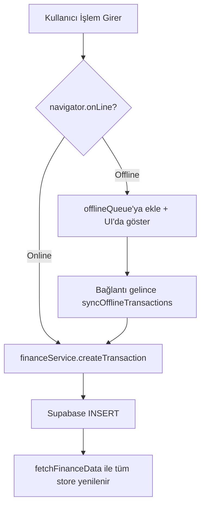

# Mimari: Faz 2, 7, 8, 12 — Çekirdek UI, State Yönetimi ve Master Ledger

> **Kapsam:** Atomic Design bileşen hiyerarşisi, Zustand store detayları, sayfa mimarisi ve Master Ledger (Büyük Defter) tasarımı.

---

## 1. Atomic Design Bileşen Hiyerarşisi

Uygulama **Atomic Design** prensibine göre katmanlıdır. Her katman bir üsttekini çağırır; aşağı doğru bağımlılık yoktur.

```mermaid
graph TD
    subgraph Atoms["⚛️ Atoms — src/components/atoms/"]
        A1[Button.tsx]
        A2[Input.tsx]
        A3[Badge.tsx]
        A4[CurrencyText.tsx]
        A5[Dialog.tsx]
        A6[IconWrapper.tsx]
        A7[SkeletonLoader.tsx]
        A8[Toaster.tsx]
    end

    subgraph Molecules["🧪 Molecules — src/components/molecules/"]
        M1[TransactionRow.tsx]
        M2[AssetCard.tsx]
        M3[BudgetProgressBar.tsx]
        M4[SpendingVelocityCard.tsx]
        M5[TagPicker.tsx]
        M6[TransactionForm.tsx]
    end

    subgraph Organisms["🦠 Organisms — src/components/organisms/"]
        O1[ImportPreviewModal.tsx]
        O2[Sidebar.tsx]
        O3[NavigationBar.tsx]
        O4[StatsSummary.tsx]
        O5[TransactionList.tsx]
        O6[BulkActionBar.tsx]
        O7[HeatmapCard.tsx]
        O8[OracleChart.tsx]
        O9[RunningBalanceChart.tsx]
        O10[BudgetSummary.tsx]
        O11[LiabilityManager.tsx]
        O12[PortfolioCard.tsx]
        O13[SavingsGoals.tsx]
        O14[TagSpendingChart.tsx]
        O15[InsightsSummary.tsx]
        O16[FileUploader.tsx]
        O17[Reconciliation.tsx]
        O18[AssetDetail.tsx]
        O19[UpcomingPayments.tsx]
        O20[GlobalSearch.tsx]
        O21[MappingDialog.tsx]
    end

    subgraph Pages["📄 Pages — src/app/"]
        P1["/ (Dashboard)"]
        P2["/transactions"]
        P3["/vault"]
        P4["/portfolio"]
        P5["/budgeting"]
        P6["/categories"]
        P7["/categories/detail?id=UUID"]
        P8["/audit"]
        P9["/settings"]
        P10["/settings/tags"]
        P11["/settings/categories"]
    end

    Atoms --> Molecules
    Molecules --> Organisms
    Organisms --> Pages
```



---

## 2. Atom Bileşenleri — API Referansı

| Bileşen | Props | Açıklama |
|---------|-------|---------|
| `Button` | `variant`, `size`, `onClick`, `disabled` | Birincil, ghost, destructive varyantları |
| `Input` | `label`, `value`, `onChange`, `error` | Tailwind input wrap'i |
| `Badge` | `variant` (income/expense/warning) | Gelir/Gider/Durum göstergesi |
| `CurrencyText` | `amount`, `className` | ₺ formatında `tabular-nums` para gösterimi |
| `Dialog` | `trigger`, `title`, `children` | Radix UI Dialog wrap'i |
| `SkeletonLoader` | `rows`, `className` | Yükleme sırasında yer tutucu |
| `CurrencyText` | `amount` | `Intl.NumberFormat('tr-TR')` ile formatlı para |

---

## 3. Zustand Store Mimarisi

### 3.1 useFinanceStore (Ana Store — ~810 satır)

`src/store/useFinanceStore.ts`

Tüm iş mantığı bu store'dan geçer. **Supabase'e doğrudan erişim yoktur** — her işlem `financeService` üzerinden yapılır.

```typescript
// State yapısı:
interface FinanceState {
  // --- Veri ---
  transactions: Transaction[]
  categories: Category[]
  assets: Asset[]
  liabilities: Liability[]
  rules: Rule[]
  schedules: Schedule[]
  tags: Tag[]
  offlineQueue: any[]
  loading: boolean
  error: string | null

  // --- Veri Yükleme ---
  fetchFinanceData(): Promise<void>   // Tüm tabloları parallel çeker
  fetchStats(): Promise<void>         // fetchFinanceData alias'ı (dashboard refresh)

  // --- Transaction CRUD ---
  addTransaction(...)                  // Tek işlem ekle (offline-aware)
  bulkAddTransactions(...)             // Toplu içe aktarım (import)
  updateTransaction(id, updates)       // Tek işlem güncelle
  updateTransactionsCategory(ids, catId) // Toplu kategori atama
  deleteTransactions(ids)              // Toplu soft delete
  syncOfflineTransactions()            // Offline queue senkronize et

  // --- Diğer CRUD ---
  addCategory / updateCategory / deleteCategory / setCategoryBudget
  addAsset / updateAsset / deleteAsset
  addLiability / updateLiability / deleteLiability
  addRule / deleteRule
  addTag / updateTag / deleteTag(id, mergeToTagId?)
  addTagsToTransactions(ids, tagIds)

  // --- Computed Getters (useMemo'ya alternatif) ---
  getIncomeTotal(): number
  getExpenseTotal(): number
  getNetWorth(): number                // Varlıklar - Borçlar
  getRunningBalance(days): [{date, balance}]
  getSpendingVelocity(): {dailyAverage, daysRemaining}
  getForecastData(days?): ProjectionPoint[]
  getCategoryBurnRates(): [{categoryId, burnRate, status}]
  getCategoryTrend(categoryId): CategoryTrend[]
  getCategoryAnomalies(categoryId): Anomaly[]
}
```

### 3.2 Persist (LocalStorage Serialization)

Store, Zustand `persist` middleware ile localStorage'a yazılır:

```typescript
partialize: (state) => ({
  transactions: state.transactions,
  categories: state.categories,
  assets: state.assets,
  liabilities: state.liabilities,
  rules: state.rules,
  schedules: state.schedules,
  tags: state.tags,        // Offline'da etiketler korunur
  offlineQueue: state.offlineQueue
})
// name: 'finance-storage'
```

### 3.3 Offline PWA Akışı



### 3.4 useAssetStore

`src/store/useAssetStore.ts` — useFinanceStore tamamlanmadan önce kullanılan erken varlık store'u. useFinanceStore'a entegre edilmiş, miras amaçlı tutulmaktadır.

### 3.5 useUIStore

`src/store/useUIStore.ts` — Global UI state:
- `isPrivacyMode` — Para miktarlarını gizle/göster
- `togglePrivacyMode()` — Sidebar'daki Gizlilik toggle'ı

---

## 4. Sayfa Mimarisi ve Bileşen Dağılımı

### Dashboard (`/`)
```
page.tsx (6.2KB)
├── StatsSummary        — Gelir / Gider / Net Worth summary kartları
├── OracleChart         — 6 aylık nakit akışı tahmin grafiği (Recharts AreaChart)
├── HeatmapCard         — Haftalık harcama yoğunluk ısı haritası
├── RunningBalanceChart — Geriye dönük bakiye grafiği
├── UpcomingPayments    — Yaklaşan ödeme hatırlatıcıları
├── SpendingVelocityCard — Günlük harcama hızı ve bakiye tükenme süresi
├── BudgetSummary       — Kategori bütçe progress barları → /categories/detail?id=
└── TagSpendingChart    — Etiket bazlı harcama dağılımı
```

### Master Ledger (`/transactions`)
```
page.tsx
├── TransactionForm     — Manuel işlem giriş formu (TagPicker ile)
├── GlobalSearch        — Tüm işlemlerde arama (description, tag, category)
├── FileUploader        ─┐
│   └── ImportPreviewModal─┘ → Ekstre import akışı
├── TransactionList     — Filtrelenebilir, sıralanabilir işlem tablosu
│   └── TransactionRow  — Çizgi başına: ikon/renk/tutar/kategori/etiketler
└── BulkActionBar       — Seçimde beliren toplu eylem barı (kategori/etiket/sil)
```

---

## 5. Veri Tutarlılığı Stratejisi

### Optimistic UI + fetchStats Pattern
Her mutasyon (ekle/sil/güncelle) şu sırayla gerçekleşir:

```
1. set({ loading: true })
2. financeService.xxx() — API çağrısı
3. set((state) => ...) — Local state güncelle (optimistic)
4. get().fetchStats()  — Tüm store'u DB'den yenile
5. toast.success(...)  — Kullanıcıya bildirim
```

Bu pattern sayesinde kullanıcı API yanıtını beklemeden sonucu görür, ardından DB'den doğrulanır.

---

## 6. Sidebar Navigasyonu

```typescript
// src/components/organisms/Sidebar.tsx
const menuItems = [
  { label: 'Dashboard',          href: '/',              icon: Home },
  { label: 'İşlem Defteri',      href: '/transactions',  icon: List },
  { label: 'Varlıklarım',        href: '/vault',         icon: Wallet },
  { label: 'Yatırım Portföyü',   href: '/portfolio',     icon: TrendingUp },
  { label: 'Bütçe ve Planlama',  href: '/budgeting',     icon: Target },
  { label: 'Kategori Analizleri',href: '/categories',    icon: PieChart },
  { label: 'Denetim & Kurallar', href: '/audit',         icon: Shield },
  { label: 'Etiket Yönetimi',    href: '/settings/tags', icon: Hash },
  { label: 'Ayarlar',            href: '/settings',      icon: Settings },
];
```

`usePathname()` ile aktif route tespit edilir ve farklı stil uygulanır.

---

## 7. Teknoloji ve Kütüphane Kararları

| Karar | Neden |
|-------|-------|
| **Zustand** (Redux'a karşı) | Daha az boilerplate, React dışı erişim kolaylığı |
| **shadcn/ui** | Accessibility-first, Radix UI tabanlı, tam kontrol |
| **Tailwind CSS** | Utility-first, responsive, dark mode yerleşik |
| **Atomic Design** | Bileşenler izole — tek atom değişimi sayfayı kırmaz |
| **Lucide React** | Tutarlı ikon seti, tree-shakeable |
| **Recharts** | React-native SVG grafik kütüphanesi, responsive container |
