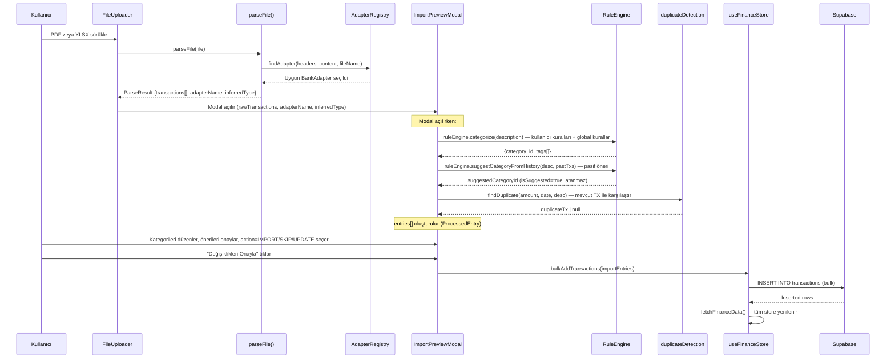

# Mimari: Faz 3, 15, 16, 18 — Veri İşleme ve Ekstre Motoru (Statement Engine)

> **Kapsam:** Banka ekstreleri için Adapter Pattern, PDF/Excel parsing, RuleEngine, Mükerrer Kontrol ve Import Preview akışı.

---

## 1. Tam Veri Akışı — Dosya Yüklemeden DB'ye



---

## 2. Adapter Pattern — Çok Banka Desteği

### Mimari

```
src/lib/parser.ts
├── AdapterRegistry (static class)
│   ├── findAdapter(headers, content, fileName) → BankAdapter
│   └── adapters[] — kayıtlı adaptörlerin listesi
│
├── IsBankasiAdapter
│   ├── canHandle(headers, content) → İş Bankası içeriği var mı?
│   ├── inferType(headers, content) → 'ACCOUNT' | 'CARD' | 'UNKNOWN'
│   ├── parseExcel(rows) → RawTransaction[]
│   └── parsePDF(text) → RawTransaction[]
│
├── EnparaAdapter
│   ├── canHandle(...) → 'ENPARA' veya 'QNB FINANSBANK' içeriyor mu?
│   ├── inferType(...) → 'KREDİ KARTI' = CARD, 'VADESİZ HESAP' = ACCOUNT
│   ├── parseExcel(rows) → Satır 10'dan başlayan Enpara formatı
│   └── parsePDF(text) → DD/MM/YYYY + TL pattern
│
├── GarantiAdapter (Placeholder)
│   ├── canHandle(...) → 'GARANTI' içeriyor mu?
│   └── parseExcel / parsePDF → [] (test verisi gelince doldurulacak)
│
└── GenericExcelAdapter (Faz 15.19 ✅)
    ├── canHandle() → false (asla birincil seçim değil — sadece fallback)
    ├── inferType(...) → KREDİ KARTI=CARD, HESAP=ACCOUNT, diğer=UNKNOWN
    └── parseExcel(rows) → Akıllı başlık tespiti:
        ├── İlk 50 satırı tarar, tarih+açıklama+tutar score'u hesaplar
        ├── Score ≥ 2 olan ilk satır header kabul edilir
        ├── findIndex ile kolon pozisyonları otomatik bulunur
        └── Bilinen tüm para formatlarını parseAmountValue ile normalize eder
```

### Yeni Adaptör Ekleme Protokolü

```typescript
class YeniBankaAdapter implements BankAdapter {
  name = 'Yeni Banka';

  canHandle(headers: string[], content: string): boolean {
    return content.toUpperCase().includes('YENİ BANKA AŞ');
  }

  inferType(headers: string[], content: string): 'ACCOUNT' | 'CARD' | 'UNKNOWN' {
    if (content.includes('KREDİ KARTI')) return 'CARD';
    return 'ACCOUNT';
  }

  parseExcel(rows: any[][]): RawTransaction[] { /* ... */ }
  parsePDF(text: string): RawTransaction[] { /* ... */ }
}

// Kayıt:
AdapterRegistry.register(new YeniBankaAdapter());
```

---

## 3. ParseResult — Çıktı Formatı

```typescript
export interface RawTransaction {
  date: string;          // ISO 8601 string
  description: string;   // Normalize edilmiş açıklama
  amount: number;        // İmzalı (+ gelir, - gider)
  type: 'INCOME' | 'EXPENSE';
}

export interface ParseResult {
  transactions: RawTransaction[];
  adapterName: string;   // "İş Bankası" | "Enpara" | ...
  inferredType: 'ACCOUNT' | 'CARD' | 'UNKNOWN';
}
```

---

## 4. İş Bankası Adapter — Detaylar

### Excel: Hesap Hareketleri / Hesap Özeti

```
Otomatik başlık satırı tespiti (ilk 50 satırı tarar, max score'u bulur):
  score += 1 if row has "tarih" column
  score += 1 if row has "açıklama" column
  score += 1 if row has "tutar" column
  
Borç/Alacak çift sütun mantığı:
  amount = Math.abs(alacak) - Math.abs(borç)
  → Gelirler pozitif, giderler negatif çıkar

Yıl formatı (`26` → 2026):
  if (year < 100) year += year < 50 ? 2000 : 1900;
```

### inferType Mantığı (Düzeltildi)
```typescript
// DÜZELTME: HESAP ÖZETİ yanlışlıkla CARD döndürüyordu
if (content.includes('KREDİ KARTI') || content.includes('KART EKSTRESİ')) return 'CARD';
if (content.includes('HESAP ÖZETİ') || content.includes('HESAP HAREKETLERİ')) return 'ACCOUNT';
```

### Kredi Kartı PDF Ayrıştırma (Regex Engine)
İş Bankası Kredi Kartı ekstreleri PDF formatında aylar bazında değişken boşluk karakteri (spacing) davranışları gösterebilir. 

```typescript
// Geliştirilmiş Regex Deseni:
const rowRegex = /(\d{2}[\/.]\d{2}[\/.]\d{4})\s+(.+?)\s{2,}(-?\s?[\d.]+,\d{2})\b/g;
```

- **Tarih Eşleşmesi (`\s+`):** Bazı pdf aylarında ("Nisan", "Mart") tarih ile açıklama arasında sadece 1 boşluk (" ") saptanırken, bazılarında ("Şubat") 3 boşluk olabilir. Bu nedenle `\s+` kullanılır.
- **Tutar Eşleşmesi (`\s{2,}`):** Açıklama satırında sayısal değerlerin (Örn. "Taksit 1.500,00") erken yakalanıp `Amount` zannedilmesini önlemek için, açıklama ile tutar sütunu arasındaki kati `min 2 boşluk` kuralı uygulanır. Böylece Tutar sütununa gelene kadar Greedy Eşleşme kontrol altında tutulur.
- **Akıllı Filtre:** Regexin yakaladığı satırların içerisinde `EXCLUDE_KEYWORDS` listesine dahil olan kelimeler (Örn: "SON ÖDEME TARİHİ", "ÖDENMESİ GEREKEN") temizlenerek ana tabloya yansıması engellenir.

---

## 5. Tutar Normalizasyonu (parseAmountValue)

Farklı banka format sorunları çözülmüştür:

```typescript
const parseAmountValue = (val: any): number => {
  // "1.234,56-" → -1234.56  (İş Bankası trailing minus)
  // "1,234.56"  → 1234.56   (İngilizce format)
  // "1.234,56"  → 1234.56   (Türkçe format)
  // "-500.00"   → -500.00   (Standard)
  
  if (str.endsWith('-')) { multiplier = -1; str = str.slice(0, -1); }
  // ... Nokta/virgül ayrımı otomatik tespit
};
```

---

## 6. RuleEngine — Kategorize Motoru

`src/services/RuleEngine.ts`

### Öncelik Hiyerarşisi

```
1. Kullanıcı Tanımlı Kurallar (En Yüksek Öncelik)
   └── rules tablosundaki keyword → category_id eşleşmeleri
   └── Daha uzun keyword daha önce değerlendirilir (specific first)

2. Global Smart Rules (Gömülü Kurallar)
   └── MIGROS, CARREFOUR, A101 → Market
   └── NETFLIX, SPOTIFY, APPLE.COM/BILL → Abonelik
   └── ENERJISA, ISKI, IGDAS → Fatura
   └── AMAZON, HEPSIBURADA, TRENDYOL → Alışveriş
   └── ... (19 kural)

3. Geçmiş Veriye Dayalı Öneri (Pasif — Kullanıcı Onayı Gerekir)
   └── suggestCategoryFromHistory(desc, history)
   └── Tam veya kısmi açıklama eşleşmesi
   └── En sık atanan category_id döndürülür
   └── *** OTOMATIK ATANMAZ — "Önerilen: [Kategori]" badge olarak gösterilir ***
```

### Tarihsel Önerinin Pasif Kalması (Faz 18 Kararı)

```typescript
// ImportPreviewModal'da:
if (!category_id) {
  const suggestedId = ruleEngine.suggestCategoryFromHistory(desc, transactions);
  if (suggestedId) {
    suggestedCategoryId = suggestedId; // Atanmaz
    isSuggested = true;               // Sadece badge gösterilir
  }
}
// Kullanıcı butona tıklayana kadar kategori atanmaz → Veri doğruluğu korunur
```

---

## 7. Mükerrer Tespit (duplicateDetection.ts)

`src/services/duplicateDetection.ts`

```typescript
// Mükerrer kriteri:
const sameAmount = Math.abs(tx.amount - newTx.amount) < 0.01;  // 1 kuruş tolerans
const sameDate   = tx.transaction_date.toDateString() === newTx.date.toDateString();

// İki kriter birlikte sağlanırsa MÜKERRER
return sameAmount && sameDate;
```

**Non-blocking:** Mükerrer tespit **engellemez**, sadece işaretler. Kullanıcı "ATLA" veya "YÜKLE" seçer.

---

## 8. ProcessedEntry — Import Preview State

```typescript
// ImportPreviewModal'ın iç state tipi
interface ProcessedEntry extends RawTransaction {
  id: string;                  // "preview-0", "preview-1"...
  category_id?: string;        // Atanmış kategori (undefined = kategorisiz)
  suggestedCategoryId?: string;// Pasif öneri (kullanıcı onayı gerekir)
  isDuplicate: boolean;
  duplicateOf?: Transaction;   // DB'deki hangi işlemle çakışıyor?
  isSuggested: boolean;        // Öneri var mı?
  tags: string[];              // Kural motoru veya kullanıcı tarafından
  action: 'IMPORT' | 'SKIP' | 'UPDATE';
}
```

---

## 9. Adaptive Sign Logic — Belge Tipi × Tutar İşareti

| Belge Tipi | Ham Tutar | Sonuç | Mantık |
|-----------|----------|-------|--------|
| `ACCOUNT` | +500 | +500 (Gelir) | Hesaba giren para = gelir |
| `ACCOUNT` | -500 | -500 (Gider) | Hesaptan çıkan para = gider |
| `CARD` | +500 | -500 (Gider) | Kartla harcanan = gider (`* -1`) |
| `CARD` | -500 | +500 (Gelir) | Karta ödeme/iade = gelir (`* -1`) |

```typescript
// documentType değiştiğinde entries yeniden hesaplanır:
const adjustedAmount = documentType === 'CARD' ? -rawTx.amount : rawTx.amount;
```

**State Preservation Kuralı:** `documentType` değiştiğinde mevcut `entries` tamamen sıfırlanmaz; sadece `amount` ve `type` yeniden hesaplanır. Kullanıcının manuel kategori/etiket seçimleri korunur.

---

## 10. Belge Tipi Otomatik Tespiti (Smart Inversion Guard)

Adaptör çalıştığında `inferredType` döndürür. Modal bu değeri başlangıç değeri olarak kullanır ama kullanıcı her zaman değiştirebilir:

```typescript
useEffect(() => {
  if (isOpen) {
    setDocumentType(inferredType); // Adaptörün önerisi başlangıç noktası
  }
}, [isOpen, inferredType]);
```

---

## 11. Garanti Adapter Notu

`GarantiAdapter` şu an **placeholder**'dır:
```typescript
class GarantiAdapter implements BankAdapter {
  parseExcel = () => [];  // Test verisi gelince doldurulacak
  parsePDF    = () => [];
}
```
Test verisi sağlandığında `Faz 15.14` işaretlenebilir.
