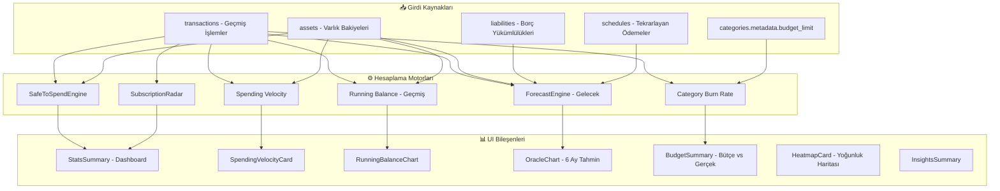

# Mimari: Faz 4, 5, 17, 19, 20, 21 — Analitik, Bütçe ve Finansal Tahminleme

> **Kapsam:** Safe-to-Spend motoru, Spending Velocity, Running Balance, Forecast Engine, Bütçe yönetimi, Abonelik Radarı ve Tag analizi.

---

## 1. Finansal Hesaplama Hiyerarşisi



---

## 2. Safe-to-Spend — Harcayabilirsin Motoru

`src/services/SafeToSpendEngine.ts`

**Formül:**  
`Safe-to-Spend = Likit Varlıklar Toplamı - Yaklaşan Ödemeler - Bütçe Hedefleri`

```typescript
// Likit varlık tespiti:
const liquidAssets = assets.filter(a =>
  a.type === 'Nakit/Banka' ||
  a.name.toLowerCase().includes('hesap') ||
  a.name.toLowerCase().includes('kart') ||
  a.metadata?.isLiquid === true   // Manuel işaretlenmiş varlıklar
);

// Fallback: Tanımlı likit varlık yoksa kümülatif net bakiye kullanılır
if (liquidBalance === 0) {
  liquidBalance = getIncomeTotal() - getExpenseTotal();
}
```

---

## 3. Running Balance — Geriye Dönük Bakiye Grafiği

`useFinanceStore.getRunningBalance(days: number)`

**Algoritma:** Mevcut bakiyeden geriye doğru gidilerek her gün için geçmiş bakiye hesaplanır:

```typescript
// Başlangıç noktası: Mevcut likit bakiye (şu an)
let tempBalance = currentBalance;

// Geriye gidilirken:
// - O günün GELİRLERİ çıkarılır (gelir gelmeseydi daha az bakiyemiz olurdu)
// - O günün GİDERLERİ eklenir (gider olmasaydı daha fazla bakiyemiz olurdu)
if (isIncome) tempBalance -= Math.abs(amount);
else          tempBalance += Math.abs(amount);
```

- Recharts `AreaChart` ile gösterilir
- X ekseni: tarih, Y ekseni: ₺ bakiye

---

## 4. Spending Velocity — Harcama Hızı Kartı

`useFinanceStore.getSpendingVelocity()`

```typescript
// Son 30 gündeki gider ortalaması:
const dailyAverage = totalExpense30Days / 30;

// Bakiyenin kaç gün daha yeteceği:
const daysRemaining = dailyAverage > 0
  ? Math.floor(currentBalance / dailyAverage)
  : 'infinite';
```

**Gösterim:** `SpendingVelocityCard` — "Günlük ₺X harcıyorsunuz, bakiyeniz Y gün yeter"

---

## 5. ForecastEngine — Oracle Engine (6 Aylık Projeksiyon)

`src/services/ForecastEngine.ts`

### Projeksiyon Girdileri

| Kademe | Kaynak | Açıklama |
|--------|--------|---------|
| Başlangıç Bakiyesi | `assets` | `type === 'Nakit/Banka'` veya `metadata.isLiquid` |
| Değişken Harcama | `transactions` (son 30 gün) | Günlük ortalama harcama hızı |
| Sabit Ödemeler | `schedules` | Aynı gün kodu (due_date.getDate()) |
| Borç Taksitleri | `liabilities` | `metadata.monthly_payment` veya `principal / term_months` |

### Formül (Her Gün için)

```typescript
// Tahmini aylık ödeme günü: start_date ile aynı ay günü
const payDay = new Date(liability.start_date).getDate();
if (payDay === dayOfMonth && remaining > 0) {
  dayExpense += installment;
}

// Değişken harcama her gün eksilir:
dayExpense += dailyAverageSpending;

runningBalance += (dayIncome - dayExpense);
```

### Sonuç

`OracleChart` bileşeninde Recharts `AreaChart` ile gösterilir:
- Yeşil bölge: Pozitif bakiye
- Kırmızı bölge: Negatif bakiye (alarm)
- `detectLowBalanceRisks()` negatif noktaları tespit eder → "Low Balance Alert"

---

## 6. Category Burn Rate — Bütçe Yakma Hızı

`useFinanceStore.getCategoryBurnRates()`

```typescript
// Ay içinde orantılı harcama beklentisi:
// Ayın 10. günündeyiz, toplam 30 günlük limit 3000₺
// Beklenen: 1000₺ (1/3)
const expectedSpend = (budgetLimit / totalDays) * dayOfMonth;

// Burn Rate = Gerçekleşen / Beklenen
const burnRate = spent / expectedSpend;

// Status:
if (spent >= budgetLimit) return 'danger';
if (burnRate > 1.2)       return 'danger';  // %20 fazla harcıyoruz
if (burnRate > 0.9)       return 'warning';
return 'safe';
```

---

## 7. Subscription Radar — Abonelik Tespiti

`src/services/SubscriptionRadar.ts`

Tekrarlayan ödemeleri tespit eden servis:
- Aynı açıklama + benzer tutar + düzenli aralık (aylık/yıllık) → Abonelik şüphesi
- Sonuçlar Dashboard'da listelenir

---

## 8. Bütçe Yönetimi

### Bütçe Limiti Kaydetme

Kategori başına bütçe limiti `categories.metadata.budget_limit` içinde saklanır:

```typescript
// setCategoryBudget store action:
const metadata = { ...category.metadata, budget_limit: limit };
await financeService.updateCategory(id, { metadata });
```

### Bütçe vs. Gerçek — BudgetSummary

`BudgetSummary` bileşeni:
- Her gider kategorisi için `BudgetProgressBar` gösterir
- `getCategoryBurnRates()` ile status alır (safe / warning / danger)
- Her kategori satırı `/categories/detail?id=UUID` sayfasına link verir (Faz 26)

---

## 9. Etiket Analizi (Tag Analytics)

`TagSpendingChart` bileşeni:

- Store'daki `transactions[].metadata.tags[]` dizisinden etiket → tutar gruplandırması yapar
- Kategori bağımsız analiz: "Tatil" etiketi altında ulaşım + konaklama + yemek birleşir
- Recharts `BarChart` ile görselleştirilir

---

## 10. Varlık ve Hedef Yönetimi

### Savings Goals (Kumbara)

`SavingsGoals` bileşeni → `savings_goals` tablosu:
- Hedef adı, hedef tutar, mevcut birikim, hedef tarih
- Ay sonu artan para manuel veya otomatik olarak hedeflere aktarılabilir (`GoalAllocator.ts`)

### Asset Detail (Eşya Takibi)

`AssetDetail` bileşeni:
- Her varlık için fatura/garanti/sertifika gibi meta bilgileri
- Garanti bitiş tarihi yaklaştığında uyarı (metadata.warranty_end_date)

---

## 11. Income / Expense Sınıflandırma Kuralı

**Tek doğru kaynak:** `amount` işareti (pozitif = gelir, negatif = gider)

Ancak mevcut `getIncomeTotal` / `getExpenseTotal` iki kaynağa bakar (OR mantığı):

```typescript
// categories.type === 'income' OR metadata.import_type === 'INCOME'
```

**Bilinen sınır:** Bir işlem hem `categories.type=income` hem `import_type=EXPENSE` ise çakışma oluşabilir. Gelecekteki iyileştirme: `amount` işareti tek kriter yapılmalı.
