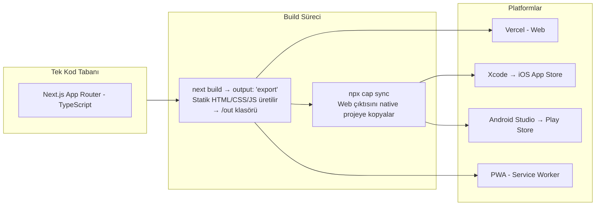

# Mimari: Faz 6, 9, 13 — Native, Static Export ve Sistem Senkronizasyonu

> **Kapsam:** Capacitor ile hybrid native köprüsü, Next.js static export zorunluluğu, PWA offline desteği, deployment ve proje yönetim protokolü.

---

## 1. Hybrid Native Mimarisi

Bu proje hem **web**, hem **iOS**, hem de **Android** platformlarını tek kod tabanından destekler:



---

## 2. Static Export Zorunluluğu ve Kısıtlamalar

`next.config.mjs`:
```javascript
const nextConfig = {
  output: 'export',    // Capacitor için zorunlu
  trailingSlash: true, // Native dosya sistemi uyumu
  images: { unoptimized: true } // Static export'ta Next/Image optimizasyonu yok
};
```

### Static Export'un Getirdiği Kısıtlamalar

| Kısıtlama | Sorun | Çözüm |
|-----------|-------|-------|
| Dinamik route yasak | `/categories/[id]` build'de hata verir | `/categories/detail?id=UUID` query param |
| Server-side kod yok | API routes çalışmaz | Supabase doğrudan client'tan çağrılır |
| `generateStaticParams` zorunlu | Her dinamik path için statik liste gerekir | Query param ile tamamen bypass edildi |

### Query Param Mimarisi (Faz 26 Kararı)

```typescript
// ❌ HATALI (output: export ile uyumsuz):
// /src/app/categories/[id]/page.tsx

// ✅ DOĞRU (static export uyumlu):
// /src/app/categories/detail/page.tsx
// URL: /categories/detail?id=UUID

// Bileşende:
const { useSearchParams } = require('next/navigation');
const searchParams = useSearchParams();
const categoryId = searchParams.get('id');
```

---

## 3. Capacitor Konfigürasyonu

`capacitor.config.ts`:
```typescript
const config: CapacitorConfig = {
  appId: 'com.financev2.app',
  appName: 'FinanceV2',
  webDir: 'out',           // Next.js static export çıktısı
  server: {
    androidScheme: 'https'
  }
};
```

### Native Build Akışı

```bash
# 1. Web çıktısını üret
npm run build          # → /out klasörü oluşur

# 2. Native projelere kopyala
npx cap sync           # iOS ve Android native projelerine aktarır

# 3. Platform bazlı build
npx cap open ios       # Xcode açılır
npx cap open android   # Android Studio açılır
```

---

## 4. PWA ve Offline Destek

Service Worker aşağıdaki durumları yönetir:
- Statik varlıkların cache'lenmesi (CSS, JS, görseller)
- API isteklerinin offline'da queue'ya alınması

### Offline İşlem Akışı

```typescript
// useFinanceStore.addTransaction içinde:
const isOnline = typeof navigator !== 'undefined' && navigator.onLine;

if (!isOnline) {
  // 1. Geçici ID ile local state'e ekle
  const tempTransaction = { ...data, id: `temp-${Date.now()}`, metadata: { isOffline: true } };
  set(state => ({
    transactions: [tempTransaction, ...state.transactions],
    offlineQueue: [...state.offlineQueue, data]
  }));
  // persist middleware localStorage'a yazar
}
// Bağlantı gelince:
// syncOfflineTransactions() → offlineQueue → financeService.createTransaction
```

---

## 5. Push Notification Mimarisi

```
Supabase Edge Function
    ↓ (tetikleyici: schedule veya threshold event)
Firebase Cloud Messaging (Android)
Apple Push Notification Service (iOS)
    ↓
Kullanıcı Cihazı (kilit ekranı bildirimi)
```

**Bildirim senaryoları:**
- Bütçe limitine yaklaşıldı
- Yaklaşan ödeme tarihleri
- Bakiye düşüklüğü uyarısı (Oracle Engine tespiti)

---

## 6. Export Servisi (Yedekleme)

`src/services/ExportService.ts`

Mevcut işlem verilerini dışa aktarır:
- **CSV:** Standart tablo formatı
- **Excel (.xlsx):** SheetJS ile zengin format

```typescript
// /transactions sayfasındaki "Dışa Aktar" butonu:
exportService.exportToExcel(filteredTransactions, 'Islemler.xlsx');
```

---

## 7. Proje Yönetim Protokolü (Faz 13)

### Dosya Yapısı

```
/
├── manifest.md           ← Ana görev listesi (READ-ONLY — Ajan değiştiremez)
├── manifest_log.md       ← Tüm zamanlar birleşik log
├── manifest_log_DDMMYYYY.md ← Günlük log dosyaları
└── mimari/               ← Bu klasör — Mimari dökümantasyon
```

### Log Format Kuralı

```
| [YYYYMMDD_HHmm] | Görev Adı | Faz N | Açıklama | STATUS | DD.MM.YYYY HH:mm | Not |
```

**Statüsler:** `DONE`, `IN_PROGRESS`, `WAITING`, `FAILED`, `DECISION`

### Anti-Loop Kuralı

Bir hata alındığında `manifest_log.md` geçmişi kontrol edilir. Daha önce denenen ve başarısız olan yöntem **asla tekrarlanmaz**. 3 başarısız denemede dur ve kullanıcıya rapor ver.

---

## 8. Sistem Tutarlılık Kontrolleri (DB Health)

- `transaction_date` — DB'ye ISO 8601 formatında yazılır; `created_at` ile ezilmez
- `user_id` — Her satırda `NEXT_PUBLIC_MANUAL_PROFILE_ID` veya `auth.uid()` olmalı
- `category_id` — Silinen kategori yerine "Diğer" sistem kategorisi otomatik atanır
- `deleted_at IS NULL` — Tüm SELECT sorgularında zorunlu filtre

---

## 9. DB Watchdog Script

`scripts/` klasöründeki Node.js script, Windows yerel klasöründeki dosyaları izleyerek yeni ekstreleri otomatik olarak parse eder. Faz 6.3 kapsamında geliştirilmiştir.
